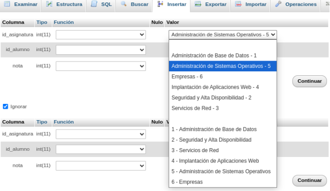

# INSTALACIONES DE CLIENTES Y SERVIDORES


## Individual
> "En esta página únicamente encontrarás la parte individual del alumno 3 y la parte grupal."  
> - Alejandro  

### **Instalación de un servidor Oracle 19c sobre Debian, otro Postgres, otro MySQL y otro de MongoDB y configuración para permitir el acceso remoto desde la red local.**
#### *Oracle*
Para la instalación de **Oracle-21c Enterprise Edition** en Debian 12 vamos a empezar instalando
los paquetes necesarios.

`sudo apt install libaio1 unixodbc`

**libaio1**: es una biblioteca de E/S del kernel de Linux que es requerida por aplicaciones como
motores de bases de datos y administradores de máquinas virtuales.

**Unixodbc**: Es un estándar de conectividad de base de datos abierta para sistemas de tipo UNIX

A continuación tenemos que establecer los parámetros del kérnel. La herramienta **sysctl** administra la confguración del núcleo a través del pseudosistema de archivos `/proc`. Además, la configuración de sysctl garantiza que `/etc/sysctl.conf` y todos los scripts en `/etc/sysctl.d` se analicen al iniciar, lo que permite aplicar opciones permanentes entre reinicios.

En nuestro caso es posible que sea necesario modificar diferentes parámetros del kérnel, por lo que
creamos el archivo `60-oracle.conf` en el directorio con los parámetros que necesitamos.
Lo hacemos con `nano /etc/sysctl.conf` y añadimos lo siguiente:
```
ale@base-de-datos:~$ sudo cat /etc/sysctl.d/60-oracle.conf
#Oracle Kernel parameters
fs.file-max=6815744
net.ipv4.ip_local_port_range=9000 65000
kernel.shmmax=536870912
kernel.sem=250 32000 100 128
```

**fs.file-max=6815744**: Es el máximo de descriptores de archivos abiertos simultáneamente para un proceso determinado.

**net.ipv4.ip_local_port_range=9000 65000**: Son los puertos asignados dinámicamente en el lado del cliente de las conexiones TCP.

**kernel.shmmax=536870912**: Tamaño máximo en bytes de un único segmento de memoria compartida de espacio de dirección virtual.

**kernel.sem=250 32000 100 128**: Son los valores máximos de los recuentos de semáforos de SystemV.

Con esto nos aseguramos que cada proceso pueda abrir una gran cantidad de descriptores de archivos, que los puertos esperados estén disponibles y que se pueda compartir suficiente memoria
entre procesos.

Es importante destacar que estos cambios no entrarán en vigor hasta que reiniciemos el sistema. Una manera que podemos aplicarlos sin reiniciar es el servicio **procps**.

```ale@base-de-datos:~$ sudo systemctl start procs```

Este comando simplemente invoca el script **/etc/init.d/procps** y aplica la configuración.

Siguiente paso es crear el fichero **/sbin/chkconfig**.

La configuración de Oracle Database EE espera el archivo, que mantiene la jerarquía del servicio en algunos sistemas basados en RPM

```
ale@base-de-datos:~$ sudo cat /sbin/chkconfig
!/bin/bash
#Oracle 21 EE installer chkconfig hack
file=/etc/init.d/oracle-ee-21c
if [[ ! `tail -n1 $file | grep INIT` ]]; then
echo >> $file
echo '### BEGIN INIT INFO' >> $file
echo '# Provides: OracleEE' >> $file
echo '# Required-Start: $remote_fs $syslog' >> $file
echo '# Required-Stop: $remote_fs $syslog' >> $file
echo '# Default-Start: 2 3 4 5' >> $file
echo '# Default-Stop: 0 1 6' >> $file
echo '# Short-Description: Oracle Enterprise Edition' >> $file
echo '### END INIT INFO' >> $file
fi
update-rc.d oracle-ee-21c defaults 80 01
```
Completamos /sbin/chkconfig con un script que crea el archivo de inicio /etc/init.d/oracle-ee-21c y garantiza que ejecute nuestro servicio de arranque.

Ahora al igual que muchos sistemas de base de datos, Oracle Database optimiza su función con memoria compartida.

Para ello establecemos el punto de montaje **/dev/shm** mediante un script.

```
ale@base-de-datos:~$ cat /etc/rc2.d/S01shm_load
!/bin/sh
case "$1" in
  start)
    mkdir /var/lock/subsys 2>/dev/null
    touch /var/lock/subsys/listener
    rm /dev/shm 2>/dev/null
    mkdir /dev/shm 2>/dev/null
    ;;
  *)
    echo error
    exit 1
    ;;
esac
```

Este script crea el directorio /var/lock/subsys y el archivo /var/lock/subsys/listener dentro de él.
Después vuelve a crear el directorio /dev/shm.
Tenemos que hacer que el script sea ejecutable:
`ale@base-de-datos:~$ sudo chmod 755 /etc/rc2.d/S01shm_load`

Ahora cada arranque del sistema debería restablecer el espacio de memoria compartida requerido.
Ahora reiniciamos la máquina para aplicar todas las configuraciones.

`ale@base-de-datos:~$ sudo reboot`

Ahora creamos un enlace simbólico, que normalmente ya están creados porque los crean los scripts del paquete de Oracle Database. 

```
ale@base-de-datos:~$ sudo ln --symbolic /usr/bin/awk /bin/awk
ale@base-de-datos:~$ sudo mkdir /var/lock/subsys
ale@base-de-datos:~$ sudo touch /var/lock/subsys/listener
ale@base-de-datos:~$ sudo sysctl fs.file-max
```

Antes de instalarlo, debemos tener sus archivos de instalación desde la [página oficial de descargas](https://www.oracle.com/database/technologies/oracle21c-linux-downloads.html).

A continuación tenemos que convertir el paquete que nos hemos descargado, **.rpm**, a un paquete **.deb**. Para ello lo haremos con **alien**.

Instalamos alien:

`ale@base-de-datos:~$ sudo apt install alien`

`ale@base-de-datos:~$ sudo alien --scripts --to-deb oracle-database-ee-21c-1.0-1.ol8.x86_64.rpm`

Aquí con --to-deb lo ponemos para generar el paquete Debian .deb.

Este paso seguramente tarde bastante tiempo (a mi me tardó aproximadamente entre 30-45 minutos)

Una vez terminado tendremos los paquetes rpm y deb.

Ahora vamos con la instalación del archivo deb.
Para instalar el paquete .deb lo haremoos con **dpkg --install**.

Una vez instalado, vamos a configurarlo. Ejecutamos 

`ale@base-de-datos:~$ sudo /etc/init.d/oracledb_ORCLCDB-21c configure`

Aquí también puede tardar un poco.

Una vez terminada la instalación, vamos a configurar las variables de entorno dentro de nuestro **.bashrc**

```
cat $HOME/.bashrc
[...]
export ORACLE_HOME=/opt/oracle/product/21c/dbhome_1
export ORACLE_SID=ORCLCDB
export ORACLE_BASE=/opt/oracle
export LD_LIBRARY_PATH=$ORACLE_HOME/lib:$LD_LIBRARY_PATH
export PATH=$ORACLE_HOME/bin:$PATH
export NLS_LANG=AMERICAN.US7ASCII
```

Lo cargamos con `source .bashrc` y entramos a la base de datos con el comando `sqlplus / as sysdba`

Ahí ya podremos configurar los usuarios que queramos.


Ahora que ya hemos configurado el acceso localmente vamos a configurar el fichero **listener.ora** y para que podamos acceder remotamente a Oracle. En el nombre del HOST, también podríamos poner el nombre de host que tenemos en **/etc/hosts** para nuestro servidor


Ya podemos acceder desde el cliente


Es importante configurar una dirección IP estática en nuestro servidor, para que éste no esté cambiando constantemente de IP.
Si queremos acceder sin ver la dirección IP del servidor añadimos al **/etc/host** la dirección IP del servidor y un nombre con el que vayamos a acceder:


#### *PostgreSQL*
Para la instalación de **PostgreSQL** lo haremos en el servidor con el comando `sudo apt install postgresql -y`

Ahora entramos con el usuario postgres y le cambiamos la contraseña. También creamos un nuevo usuario.

`ale@base-de-datos:~$ sudo -u postgres psql`

```
postgres=# ALTER USER postgres with password 'contraseña'
ALTER ROLE

postgres=# CREATE USER alejandro with password 'contraseña'
CREATE ROLE
```
Intentamos entrar con el usuario a la base de datos que hemos creado de prueba y nos dará un fallo:
```
ale@base-de-datos:~$ psql -U alejandro -d prueba
psql: error: falló la conexión al servidor en el socket <</var/run/postgresql/.s.PGSQL.5432>>: FATAL: la autentificación Peer falló para el usuario alejandro
```

Si nos da este error tendremos que modificar el fichero /etc/postgresql/15/main/pg_hba.conf en el que vamos a modificar todas las líneas que tienen peer por md5.

A continuación reiniciamos el servicio. Y ya podremos entrar al servidor.
`ale@base-de-datos:~$ sudo systemctl restart postgresql`

Con el comando `sudo apt install postgresql-client` instalamos el cliente en otra máquina.

Para configurar el acceso remoto al servidor modificamos el fichero **/etc/postgresql/15/main/pg_hba.conf** donde añadimos la línea siguiente:
`host   all         all         192.168.1.0/24      md5`

A continuación modificamos el fichero /etc/postgresql/15/main/postgresql.conf donde buscamos la línea de **listen_addresses** que está comentada y le añadiremos la dirección IP del servidor.
`listen_addresses = '192.168.1.147'`

Por último reiniciamos el servicio.


#### *MariaDB/MySQL*

Para la parte del servidor, vamos a instalar el paquete de **mariadb-server**

`ale@base-de-datos:~$ sudo apt install mariadb-server`

Luego comprobamos que esté iniciado el servicio. Si no lo está lo hacemos con `sudo systemctl start mariadb`.

Una vez tengamos el servicio activo, vamos a realizar la configuración, con el comando `mysql_secure_installation` en el que vamos dejar las opciones por defecto.

Para instalar el cliente lo haremos con el comando `sudo apt install mariadb-client`.

Pasamos a la configuración del servidor para poder acceder remotamente al servidor. Para ello modificamos el fichero **/etc/mysql/mariadb.conf.d/50-server.cnf**

En el fichero, buscaremos la opción de bind-address y modificaremos la que tenemos por la 0.0.0.0

Ahora en el servidor vamos a entrar como root y vamos a crear una base de datos nueva (pruebas) y también crearemos un nuevo usuario al que le vamos a dar algunos permisos para poder acceder a la base de datos y hacer algunas pruebas.

```
ale@base-de-datos:~$ msyql -u root -p
Enter password: 
[...]
MariaDB [(none)]>
```
Para que el usuario que creemos se pueda conectar remotamente, debemos poner en lugar de localhost, el símbolo *%*

```
MariaDB [(none)]> CREATE DATABASE pruebas;
MariaDB [(none)]> CREATE USER 'ale'@'%' IDENTIFIED BY 'contraseña';
MariaDB [(none)]> GRANT SELECT, INSERT, CREATE ON pruebas.* TO 'ale'@'%';
```
Ahora para acceder remotamente, añadiremos al **/etc/hosts** la dirección IP del servidor y el nombre con el que vamos a acceder de manera que no vamos a tener que acceder con la IP a la vista:

```
ale@vodkita:$ mysql -u ale -p -h bbdd
Enter password:
[...]
MariaDB [(none)]> use pruebas
Database changed
MariaDB [pruebas]> CREATE TABLE usuarios (ID NUMERIC(3) PRIMARY KEY, nombre VARCHAR(20));
MariaDB [pruebas]> INSERT INTO usuarios VALUES (1,'Alejandro');
MariaDB [pruebas]> INSERT INTO usuarios VALUES (2,'Pineda');
MariaDB [pruebas]> SELECT * FROM usuarios;
+----+-----------+
| ID | nombre    |
+----+-----------+
|  1 | Alejandro |
|  2 | Pineda    |
+----+-----------+
```

#### *MongoDB*
Para la instalación de MongoDB vamos a instalar **gnupg** y **curl**
`ale@base-de-datos:~$ sudo apt install gnupg curl`

Luego vamos a importar la clave GPG pública de MongoDB.
`ale@base-de-datos:~$ curl -fsSL https://pgp.mongodb.com/server-7.0.asc | sudo gpg --dearmor -o /etc/apt(trusted.gpg.d/mongodb-server-7.0.gpg)`

Añadimos un nuevo repositorio a la lista de fuentes de Debian.

`ale@base-de-datos:~$ echo "deb [ arch=amd64,arm64 ] https://repo.mongo.org/apt/ubuntu jammy/mongodb-org/7.0 multiverse" | sudo tee /etc/apt/sourcer.list.d/mongodb-org-7.0.list`

Por último actualizamos y descargamos el mongoDB

`ale@base-de-datos:~$ sudo apt update && sudo apt install -y mongodb-org`

Comprobamos que el servicio está activo con `sudo systemctl status mongod.service`. Si no está activo lo iniciamos con `sudo systemctl start mongod.service`

Comprobamos que podemos entrar

```
ale@base-de-datos:~$ mongosh
[...]

test>
```
Para el acceso remoto modificamos el fichero **/etc/mongod.conf** y buscamos el apartado de **network interfaces** donde lo modificamos y ponemos **0.0.0.0**, también activaremos el control de acceso, para que los usuarios tengan que autenticarse con usuario y contraseña.

En el fichero:
```
[...]
# network interfaces
net:
    port: 27017
    bindIp: 0.0.0.0
[...]
security:
    authorization: enabled
```
Reiniciamos el servicio

`ale@base-de-datos:~$ sudo systemctl restart mongod.service`

Ahora crearemos un usuario administrador en **admin** y accedemos con él a la base de datos.

```
ale@base-de-datos:~$ mongosh
[...]

test> use admin
admin> db.createUser({user: "root", pwd: "contraseña", roles: ["root"]})
```
```
ale@base-de-datos:~$ mongosh -u root -p contraseña
```
### **Instalación y prueba del funcionamiento básico de Neo4J.**

**Teoría de grafos:**

Un grafo es una colección de objetos en la que cada objeto tiene una serie de relaciones con otrosobjetos.

**Neo4j** es una base de datos que los datos están guardados como un grafo. Se puede construir el modelo conforme se importan los datos.

**Nodos**: Representan entidades u objetos. Pueden tener etiquetas que indican su tipo (Ej Persona, producto).

**Relaciones:** Conectan los nodos. Tienen una dirección (en consultas pueden ser recorridas en cualquier dirección). Pueden tener tipos que describen la naturaleza de la relación (Ej Amigo_de, Compró).

**Propiedades**: Tanto nodos como relaciones pueden tener propiedades, que son pares clave-valor que almacenan información adicional. Por ejemplo un nodo, persona, puede tener propiedades como nombre y edad.

**Etiquetas**: Categorías que se asignan a los nodos para clasificarlos y facilitar las consultas.


Para su instalación ejecutamos el comando

`sudo wget -O /usr/share/keyrings/neo4j-archivekeyring.gpg https://debian.neo4j.com neotechnology.gpg.key` 

que nos agregará la clave GPG del repositorio de Neo4j

Después de agregar la clave, añadimos el repositorio:

`deb [signed-by=/usr/share/keyrings/neo4j-archive-keyring.gpg] https://debian.neo4j.com stable main`

Actualizamos e instalamos neo4j

`sudo apt update && sudo apt install neo4j`

Una vez instalado, iniciamos el servicio.

`sudo systemctl start neo4j.service`

Para el acceso remoto modificamos el fichero **/etc/neo4j/neo4j.conf** en el que cambiaremos el valor de la línea **server.default_listen_address** y le añadimos **0.0.0.0**

Una vez hecho esto reiniciamos el servicio y desde el navegador de nuestra máquina local, podemos acceder con la dirección de la máquina virtual y el puerto 7474


Para acceder por primera vez nos pide un usuario y contraseña que será neo4j para los dos, ya que viene por defecto. Una vez dentro podemos cambiarla con la contraseña que queramos nosotros:


Una vez ya dentro, vamos a empezar con los primeros pasos básicos

**Lenguaje Cypher:**
Es el lenguaje propio de Neo4j. La sintaxis usa un estilo ascii-art para hacer los comandos intuitivos.

Los nodos se representan con círculos y las relaciones con flechas. Su representación en ascii-art consiste en poner nodos entre paréntesis () y relaciones como flechas etiquetadas por corchetes []:

***(nodo)-[:RELACIÓN]-> (nodo)***

Las propiedades de los nodos o las relaciones se indican con una estructura parecida a un diccionario:

`(nodo {name:'Alejandro', surname:'Albaladejo'})`

Las etiquetas se indican después de definir la variable:
`(nodo:Person {name:'Alejandro', surname:'Albaladejo'})`

Vamos a empezar creando un nodo:
```
CREATE (Al:Person {name:'Alejandro', surname'Albaladejo'})
CREATE (Ja:Person {name: 'Juan Antonio', surname: 'Pineda'});
CREATE (Ki:Person {name: 'Kiko', surname: 'Doblado'});
CREATE (Jk:Person {name: 'Juan Carlos', surname: 'Martín'});
```


Vamos a crear Relaciones que Alejandro conoce a Juan Antonio, Juan Carlos y a Kiko y que Kiko también conoce a Juan Antonio. Juan Carlos solo conoce a Alejandro.
```
MATCH (Al:Person {name: 'Alejandro'}), (Ja:Person {name: 'Juan Antonio'})
CREATE (Al)-[:KNOWS]->(Ja);

MATCH (Al:Person {name: 'Alejandro'}), (Ki:Person {name: 'Kiko'})
CREATE (Al)-[:KNOWS]->(Ki);

MATCH (Ja:Person {name: 'Juan Antonio'}), (Ki:Person {name: 'Kiko'})
CREATE (Ja)-[:KNOWS]->(Ki);

MATCH (Jk:Person{name:'Juan Carlos'}),(Al:Person{name:'Alejandro'})
CREATE (Jk)-[:KNOWS]->(Al);

```

Para explicarlo cojo la primera relación creada.

**MATCH** busca dos nodos en la base de datos que cumplan con las condiciones especificados. En este caso un nodo de tipo **Person** con los nombres de Alejandro y de Juan Antonio. Una vez que se encuentran los dos nodos, **CREATE**, crea una relación entre ellos que se denomina **KNOWS**, es decir que Alejandro conoce a Juan Antonio.

Ahora vamos a hacer alguna Consulta para ver todos los nodos y sus relaciones.

Para empezar buscamos todos los nodos de tipo **Person**:
`MATCH (p:Person) RETURN p;`

La respuesta a la consulta se puede ver de distintas maneras.

1. **GRAFOS**
   
   

2. **JSON**

   

3. **Texto en una tabla**

   

Podemos contar también por ejemplo cuántas personas hay en la base de datos:

`MATCH (p:Person) RETURN count(p) AS Num_Personas`


Buscar información sobre Kiko:

`MATCH (Ki:Person {name:'Kiko'}) RETURN Ki`


Encontrar relaciones de a quien conoce Juan Antonio.


### **Realización de una aplicación web en cualquier lenguaje que conecte con el servidor ORACLE tras autenticarse, muestre las tablas accesibles para ese usuario y permita acceder a los registros de alguna de ellas.**

Vamos a mostrar el funcionamiento de la página web.

El código de esta página se puede ver en:
[Código web](https://github.com/alealbaladejo/web_oracle_bbdd1)

Para comenzar iniciamos sesión con un usuario incorrecto


Vemos que nos da error de usuario o contraseña e iniciamos con un usuario correcto.


Nos lleva al apartado de tablas donde tenemos una lista con las tablas que hemos creado nosotros y sobre las que tenemos el permiso SELECT para hacer consultas sobre tablas de otros usuarios.


Si iniciamos sesión con otro usuario que no tiene permisos sobre la tabla de usuarios por ejemplo:


Vemos que solo puede ver una tabla sobre la que tiene permisos.


Si accedemos a las tabla de MODULOS veremos su contenido.


Si accedemos a la tabla del otro usuario, USUARIOS, veremos también el contenido de la tabla.


## **Grupal**
### **Instalación de SQL Developer en Win con cliente remoto de Oracle**

Para poder descargar [SQL Developer](https://www.oracle.com/database/sqldeveloper/technologies/download/) nos dirigimos a la página oficial de este y nos descargamos la versión de windows 64-bit que es la que vamos a necesitar.

Y ahora para proceder con la instalación nos dirigimos a la carpeta sqldeveloper que la hemos descomprimido en el Escritorio. Pulsamos sobre sqldeveloper para comenzar la instalación


Ahora vamos a añadir el usuario de la base de datos albaladejo a mi cliente. Para ello, crearemos una nueva conexión y proporcionaremos los datos de identificación, como el usuario, la contraseña, la IP, etc. Para finalizar, le daremos a **Conectar**:


Ahora vamos a realizar un select para ver si funciona correctamente el cliente sql Developer para ello nos iremos a preview y pondremos la consulta que queramos realizar en mi caso un simple select:


Ahora realizaremos un insert a la tabla usuario añadiendo el usuario *javi*, esto lo hacemos para comprobar que tenemos también permisos para insertar datos:


Ahora volveremos a realizar un select de la misma tabla y veremos que se ha añadido el usuario *javi*:


Para ver que realmente se funciona este cliente de oracle nos iremos al servidor oracle de Albaladejo y comprobaremos un select que los datos realmente se han creado:


### **Administración web para Postgres y utilidad desde cliente remoto**

Para esta parte de la practica grupal utilizaremos la herramienta pgAdmin. 

Es una herramienta de administración de código abierto y una plataforma de desarrollo para el servidor de bases de datos PostgreSQL. El pgAdmin viene con versiones Desktop y Server. La versión Desktop puede instalarse en tu máquina local, mientras que la versión Server está basada en web y se ejecutará bajo el servidor web.
**Instalación de pgAdmin**
Lo primero que haremos es añadir el repositorio **pgadmin4**.

`sudo echo "deb [arch=amd64 signed-by=/usr/share/keyrings/pgadmin4.gpg] https://ftp.postgresql.org/pub/pgadmin/pgadmin4/apt/$(lsb_release -cs) pgadmin4 main"\ | sudo tee /etc/apt/sources.list.d/pgadmin4.list`

Ahora añadiremos las claves GPG del repositorio pgAdmin4.

`curl -fsSL https://www.pgadmin.org/static/packages_pgadmin_org.pub | sudo gpg --dearmor -o /usr/share/keyrings/pgadmin4.gpg`

Actualizaremos los repositorio de debían y instalaremos el paquete pgAmind4-web.

`sudo apt update && sudo apt install pgadmin4-web`

Una vez instalado usaremos el script de pgAdmin4 para configurar el usuario y contraseña de administración del login.

`sudo /usr/pgadmin4/bin/setup-web.sh`

En las dos preguntas responderemos y de yes a que queremos activar el modulo wsgi y para reiniciar el servidor web apache2.

Buscaremos la ip de la máquina instalado pgAdmin4 y la pondremos en el navegador más la /pgadmie4. Si es desde la misma máquina con pgadmi4 debes de buscar la dirección 127.0.0.1 e iniciaremos sesión en el login con las credenciales puestas en el script anterior.


Una vez dentro de la web le daremos a agregar un nuevo servidor.


Seguiremos los pasos de las capturas para añadir un servidor.


Una vez añadida podemos ver a la izquierda que se nos añadirá las base de datos del servidor.


Ahora añadiremos una nueva base de datos.


Veremos como esta se ha añadido.


Ahora crearemos una nueva tabla aparte de las ya creado porque a utilizado la base de datos kiko como plantilla.

Está en la ruta de **pgadmin4/Esquemas/Tablas**


Veremos como la tabla se añadió.


Insert a la tabla creada.


Luego debajo nos saldrá los atributos de la tabla y le daremos a lo marcado en rojo para añadir contenido y en la parte azul guardamos los cambios.


Ahora nos iremos al cliente, accederemos a la base de datos y verificaremos que la tabla esta con el contenido añadido.


### **Administración web para MySQL y utilidad desde cliente remoto**

Para comenzar vamos a instalar un servidor web e iniciarlo si no lo tenemos instalado. Vamos a usar **apache2**
`sudo apt install apache2 -y`

El lenguaje de programación PHP y el entorno de codificación son esenciales para ejecutar una aplicación web como **phpMyAdmin**. Por eso vamos a instalar los paquetes básicos de PHP y los complementos de **Apache** y **MySQL** con el siguiente comando:
`sudo apt -y install php php-cgi php-mysqli php-pear php-mbstring libapache2-mod-php phpcommon php-phpseclib php-mysql`

Lo siguiente será instalar y configurar MySQL.
`sudo apt install mariadb-server mariadb-client -y`

Una vez configurado todo para permitir el acceso remoto, lo siguiente es descargarnos **phpMyAdmin** con:
`wget -P Downloads https://www.phpmyadmin.net/downloads/phpMyAdmin-latest-alllanguages.tar.gz`

Ahora descargamos el archivo GPG.asc que corresponde a su versión de **phpMyAdmin**
`wget https://www.phpmyadmin.net/downloads/phpMyAdmin-latest-all-languages.tar.gz.asc`

Y lo verificamos con `gpg --verify phpMyAdmin-latest-all-languages.tar.gz.asc`

Después de verificar la clave, descomprimimos el archivo:
```
sudo mkdir /var/www/html/phpMyAdmin
sudo tar xvf phpMyAdmin-latest-all-languages.tar.gz --strip-components=1 -C /var/www/html/phpMyAdmin
```

Ahora para evitar el acceso no autorizado y proteger la integridad y confidencialidad de los datos.
Creamos un archivo de configuración determinado
`sudo cp /var/www/html/phpMyAdmin/config.sample.inc.php /var/www/html/phpMyAdmin/config.inc.php`

Y editamos el archivo donde buscaremos la línea cfg['blowfish_secret'] = ''; y añadiremos una clave.


A continuación le cambiamos los permisos al archivo y le cambiamos el propietario a www-data

```
sudo chmod 660 /var/www/html/phpMyAdmin/config.inc.php
sudo chown -R www-data: /var/www/html/phpMyAdmin
sudo systemctl restart apache2
```
Ya podemos entrar en el navegador de nuestro host con la dirección IP de nuestro servidor y la localización de phpMyAdmin


Una vez dentro vamos a explicar un poco el funcionamiento.
Vamos a entrar en la base de datos de PHPAdmin


Ahí vamos a crear una tabla nueva.


Cuando le damos a crear se nos abre la configuración de la tabla:


Modificamos lo que necesitemos, vemos que podemos ponerle el nombre de las columnas, el tipo de dato que es, la longitud, la primary key, etc.

Al pulsar sobre guardar veremos la nueva tabla creada.


Si nos vamos a la estructura podremos ver y editar si lo necesitamos la tabla.


Para insertar datos en la tabla, nos vamos a la pestaña donde pone **Insertar**


Vamos ahora a crear unas tablas para comprobar como se realizan las foreign key de otras tablas.

**Tabla módulos**


**Tabla notas**


Hasta aquí la creación de las tablas es igual. Para añadir las claves foráneas iremos a la pestaña **Estructura** y ahí completamos los datos de la siguiente forma, indicando las claves foráneas. Con los desplegables podremos ayudarnos ya que nos salen las opciones disponibles en cada caso.


Para insertar datos en la nueva tabla, nuevamente nos vamos a la pestaña Insertar donde ahí volverá a haber un desplegable con los posibles datos que podemos añadir (son los datos de la otra tabla a la que hace referencia).



Ingresamos unos cuantos datos y quedaría así:


Para hacer alguna consulta nos iremos a la parte de la base de datos y vamos a la pestaña **Generar una consulta**. Ahí podremos indicar que columnas y de que tablas queremos que nos seleccione.


Vemos que nos muestra los datos ingresados.


### Administración web para MongoDB y utilidad desde cliente remoto

Ahora vamos a proceder con la instalación de un cliente web mongo en nuestro caso vamos a utilizar mongo compás que es una herramienta que es oficial de mongodb esta la podremos encontrar en este [enlace](https://www.mongodb.com/docs/compass/current/), nosotros vamos a descargar la versión de ubuntu ya que debian está basada en este, copiaremos el enlace para luego descargas la aplicación:

Ahora nos iremos a nuestro cliente y con un wget y el enlace que hemos cogido antes lo pegamos y nos lo descargamos con wget

Y con `sudo apt install ./mongo-compass-1.44.5_amd64.deb` nos descargaremos el paquete

Ahora iniciaremos el programa poniendo en la terminal  usando:
`mongodb-compass`

Y luego nos saldra esta pestaña la cuál es la que vamos a utilizar para configurar un servidor remoto de mongo en este caso el servidor va hacer de Albaladejo para crear la conexión a ese servidor le tendremos que dar a **add new connection**:


Una vez le demos a añadir una nueva conexión nos saldrá los datos que tenemos que meter en la conexión como la ip del servidor de Albaladejo en mi caso, el puerto y lo más importante el usuario y la contraseña de la base de datos y el usuario:


Ya metido todos esos datos podremos ver que se nos ha conectado perfectamente a la base de datos de Albaladejo y podemos ver la base de datos que se llama prueba que dentro tiene una colección que se llama usuarios y vemos el contenido de este, solo tiene dos documentos insertados:


Para crear otro documento le daremos en **ADD DATA** y tenemos dos formas de añadir documentos de forma manual, que sería la parte de **“insert document”** o bien si tenemos un archivo JSON pues lo podremos meter con la opción de **“Import JSON or CSV file”**. En nuestro caso crearemos un  archivo de forma manual:


Para crear el documento pues sería parecido que si lo hacemos desde la línea de comando voy añadir el documento Pineda que tiene el nombre y el apellido el ID se lo dará mongodb el solo y para insertar le daremos a **insert**:


Para modificar un documento le daremos a este y en la parte inferior derecha veremos una opción de update le daremos a esta y nos dejará modificar el documento, si queremos añadir nuevos valores pues le daremos al más que temos en la parte de la izquierda y ponemos la clave y el valor en mi caso localidad, y para guardas cambios le daremos a update:


Y aquí podemos ver que se ha actualizado con éxito:

También podemos hacer consultas para ello le daremos a la parte de querry, y nos saldrá una terminal en la que podremos poner todas la consultas, eliminaciones … de los documentos y colecciones en mi caso voy hacer una simple consulta y como vemos funciona perfectamente:


Y ya para finalizar vamos a eliminar un documento en nuestro caso el de Raul que no esta en nuestro grupo, para ello es tan simple como darle a delete y eliminarlo :


Con mongo compás hemos visto que es una aplicación muy útil ya que la administración de la base de datos se hace muy sencilla y amena.

### Tabla comparativa NoSQL

| Cassandra | Redis | CouchDB | Neo4J |
|-----------|-------|---------|-------|
|  |  |  |  |
| **VENTAJAS** |
| Operaciones de mantenimiento sin interrumpir el servicio. |El  acceso a la información es muy rápido ya que los datos se almacena en memoria principal  | Cuenta con mecanismos integrados para resolver conflictos de forma automática | Permite representar relaciones complejas de forma intuitiva mediante un modelo de grafo, donde los nodos representan entidades y las aristas representan las conexiones directas entre ellas |
| Almacenamiento columnar que permite optimizar las consultas y análisis. | Redis permite asignar un tiempo de vida a las claves, lo que facilita la expiración automática de datos cuando ya no son necesarios. | Alta disponibilidad | Consultas a alta velocidad sobre relaciones. En lugar de depender de JOINS, accede directamente a las relaciones. |
| Optimizado para manejar grandes volúmenes de datos distribuidos. | Redis admite transacciones, lo que significa que los comandos pueden ejecutarse como una cola en lugar de ejecutarse uno a la vez | Accesible a través de HTTP, lo que facilita la integración con aplicaciones web. | El lenguaje es fácil de aprender y usar. Está inspirado en SQL. |
| Soporte de código abierto con una comunidad activa y opciones empresariales | Redis tiene clientes en todos los lenguajes de programación populares, permitiendo un uso mucho más flexible  | Permite almacenar datos sin un esquema fijo, adaptándose a datos dinámicos. | Tiene una amplia comunidad de usuarios, para solucionar problemas que se presenten. |
| **MODELO DE DATOS** |
| Basado en columnas| Clave-valor | Orientado a documentos | Grafos de nodos y relaciones |
| **LENGUAJE** |
| CQL | Operaciones Clave-Valor | JavaScript | Cypher |
| **CASOS DE USO** |
| **Big Data** . Almacena y procesa grandes volúmenes de datos en tiempo real, ideal para análisis de clics, logs y telemetría. | **Caching**. Para acceder a datos rápidamente sin recurrir a la base de datos principal. | **Aplicaciones sin conexión**. Ya que permite la sincronización automática cuando el dispositivo vuelve a estar conectado | **Redes sociales**. Las conexiones entre personas y las interacciones son claves |
|**Big Data.** Almacena y procesa grandes volúmenes de datos en tiempo real, ideal para análisis de clics, logs y telemetría. |  **Caching**. Para acceder a datos rápidamente sin recurrir a la base de datos principal | **Aplicaciones sin conexión**. Ya que permite la sincronización automática cuando el dispositivo vuelve a estar conectado | **Redes sociales**. Las conexiones entre personas y las interacciones son claves |
| **Gestión de contenido**. Almacena y entrega rápidamente contenido multimedia. | **Contadores en tiempo real**. Como los de visitas a sitios web o los likes en redes sociales. | **Entornos multiusuarios**. Perfecto para escenarios donde se necesita replicar datos entre múltiples servidores o dispositivos |  **Sistemas de recomendación**. Donde se desarrollar conexiones entre usuarios, productos y otros elementos |
| **Alta disponibilidad**. Aplicaciones críticas (bancos, comercio electrónico) que no pueden permitirse caídas del servicio. | **Sesiones de usuario para aplicaciones web**. La persistencia a largo plazo no es necesaria | **Sistemas de gestión de contenido**. Almacena datos en formato JSON, ideal para aplicaciones que manejan documentos flexibles o datos no estructurados | **Mapeo de redes de colaboración o influencia.** Los sistemas de investigación pueden analizar redes de colaboración entre investigadores o influencias dentro de comunidades profesionales. |