# INTERCONEXIÓN DE SERVIDORES DE BASES DE DATOS
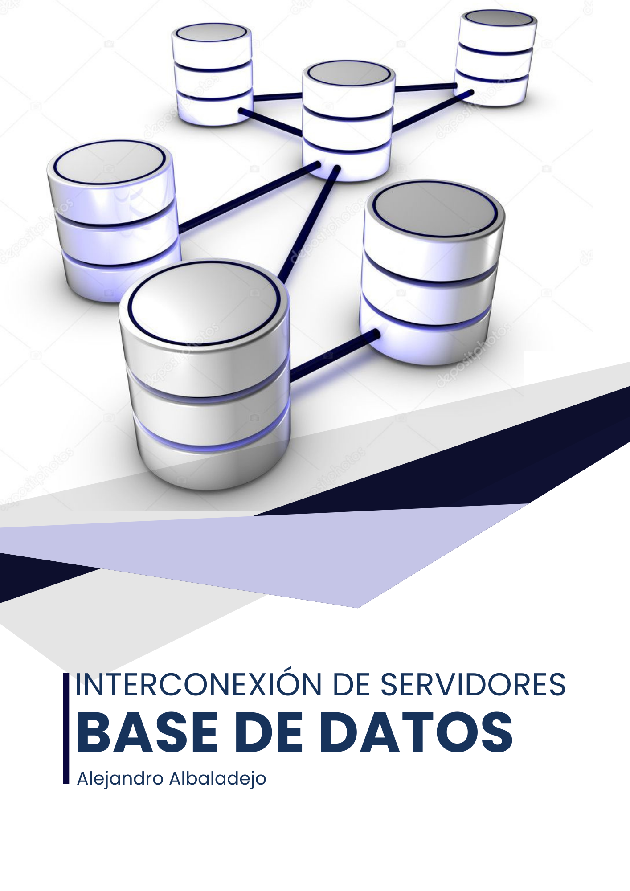

Las interconexiones de servidores de bases de datos son operaciones que pueden ser muy útiles en diferentes contextos. Básicamente, se trata de acceder a datos que no están almacenados en nuestra base de datos, pudiendo combinarlos con los que ya tenemos.

En esta práctica veremos varias formas de crear un enlace entre distintos servidores de bases de datos.


## Realizar un enlace entre dos servidores de bases de datos ORACLE, explicando la configuración necesaria en ambos extremos y demostrando su funcionamiento realizando alguna operación que implique el uso simultáneo de ambas bases de datos.

Lo primero que tenemos que tener serán dos servidores de bases de datos ORACLE. En mi caso los servidores serán **abd (192.168.1.168)** y **abd2 (192.168.1.167)**. En cada uno de ellos tenemos un usuario alejandro con permisos sobre la base de datos.

Vamos a configurar los ficheros **tnsnames.ora** de cada servidor. Como ya sabemos estos ficheros se usan para definir alias de red para permitir a las aplicaciones clientes conectarse a una base de datos Oracle.

En el **servidor abd** y **abd2** quedarían de la siguiente forma:

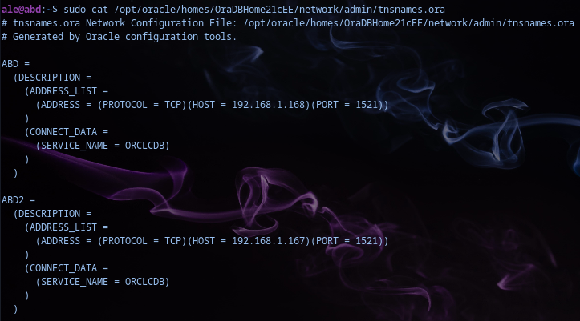

A continuación tenemos que asegurarnos que el fichero **sqlnet.ora**, que se utiliza para resolver los nombres de servicio de Oracle, esté siendo utilizado correctamente. Quedaría así:

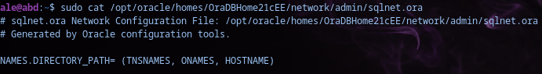

Una vez que hayamos modificado estos archivos tendremos que reiniciar el servicio de Oracle, para que se apliquen los cambios.
`sudo /etc/init.d/oracledb_ORCLCDB-21c restart`

Si queremos acceder desde nuestra máquina cliente a los servidores, tendremos que configurar el **tnsnames.ora** también en el cliente que quedaría de la misma forma.

A continuación vamos a usar un comando nuevo como es **tnsping**. Es un comando que verifica si el nombre del servicio definido en **tnsnames.ora** se puede resolver o no correctamente. Simula una conexión a la base de datos especificada sin llegar a conectarse.

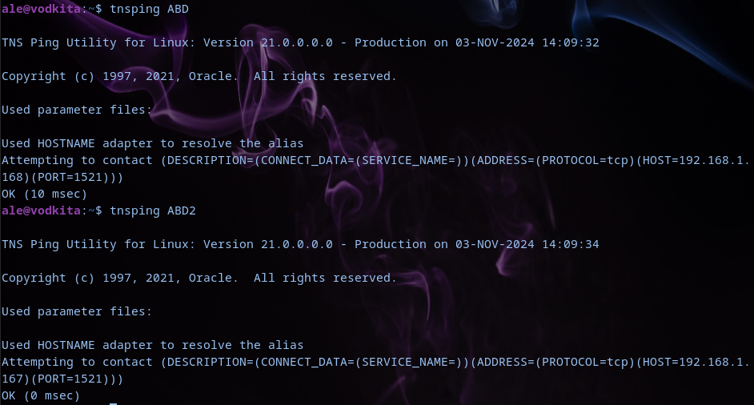

Como vemos, al hacer **tnsping**  a las dos bases de datos que tenemos, ha salido satisfactoriamente, por lo que lo tenemos bien configurado.

Ahora nos vamos a conectar a la base de datos de **abd** donde vamos a crear el enlace para poder acceder a datos de la base de datos de **abd2**:
```
ale@vodkita:~$ sqlplus alejandro/contraseña@//abd:1521/ORCLCDB
[...]
SQL> CREATE DATABASE LINK abd2_link CONNECT TO alejandro IDENTIFIED BY contraseña USING 'ABD2';

Enlace con la base de datos creado.
```

Para ver el funcionamiento vamos a crear alguna tabla en cada una de las bases de datos.

En **abd** creamos la tabla de **empleados** con algunos datos como **id, nombre y puesto**.

```
SQL> CREATE TABLE empleados (
    empleado_id NUMBER PRIMARY KEY,
    nombre VARCHAR2(30),
    puesto VARCHAR2(30));

Tabla creada.

SQL> INSERT INTO empleados VALUES (1,'Alejandro', 'Ingeniero');

1 fila creada.

SQL> INSERT INTO empleados VALUES (2,'Pineda', 'Analista');

1 fila creada.

SQL> INSERT INTO empleados VALUES (3,'Kiko', 'Desarrollador');

1 fila creada.

```
A continuación nos conectamos a la base de datos del servidor abd2, donde vamos a crear una tabla proyectos, con el id, nombre y el empleado a cargo.

```
ale@vodkita:~$ sqlplus alejandro/contraseña@//abd2:1521/ORCLCDB
[...]
SQL> CREATE TABLE proyectos (
    proyecto_id NUMBER PRIMARY KEY,
    nombre VARCHAR2(100),
    empleado_id NUMBER);

Tabla creada.

SQL> INSERT INTO proyectos VALUES (1,'Desarrollo de Software',1);

1 fila creada

SQL> INSERT INTO proyectos VALUES (2,'Implementación de sistema',2);

1 fila creada

SQL> INSERT INTO proyectos VALUES (3,'Actualización de infraestructura',3);

1 fila creada

```
Una vez que tengamos ya los datos insertados, vamos a poder hacer una consulta estando conectados a **abd**, obteniendo datos que existe en **abd2**.

Por ejemplo con los datos que hemos introducido, vamos a sacar el nombre del empleado, el puesto y proyecto en el que están involucrados todos los empleados.

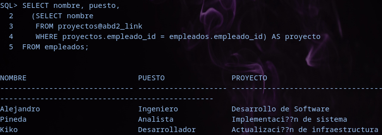

Como vemos, hemos creado una consulta usando el abd2_link  que hemos creado anteriormente.

Para comprobar que tenemos el enlace creado, podemos hacerlo con la siguiente consulta:

```
SELECT db_link, username, host
FROM user_db_links;

DB_LINK         USERNAME        HOST
-------------   -----------     ------------
ABD2_LINK       ALEJANDRO       ABD2        
```
Donde vemos el nombre del enlace (**abd2_link**), el usuario que tiene acceso a ese enlace (**alejandro**) y el host al que va dirigido ese enlace (**abd2**)

Este enlace solamente nos va a servir si nos conectamos a **abd**, pero si queremos que también nos sirva si nos conectamos a **abd2**, tendremos que crear un nuevo link en dicha base de datos.
Para ello, entramos en **abd2** y ejecutamos el comando que usamos antes para crear el link, pero cambiando **USING** **‘ABD2’** POR  **USING** **‘ABD’**

```
ale@vodkita:~$ sqlplus alejandro/contraseña@//abd2:1521/ORCLCDB
[...]
SQL> CREATE DATABASE LINK abd2_link CONNECT TO alejandro IDENTIFIED BY contraseña USING 'ABD';

Enlace con la base de datos creado.
```

Ahora para hacer la consulta, hay que modificar, para que en lugar de seleccionar la tabla proyectos con el enlace, sea la tabla empleados, ya que en esta base de datos la que tenemos nosotros es la de proyectos.

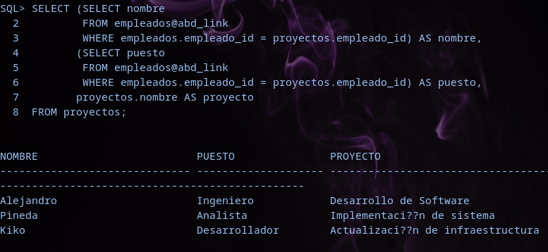

Vemos que nos devuelve la misma información.
Si comprobamos la tabla empleado en abd2, vemos que no tiene datos, sin embargo, si hacemos la consulta sobre el link, vemos que sí:

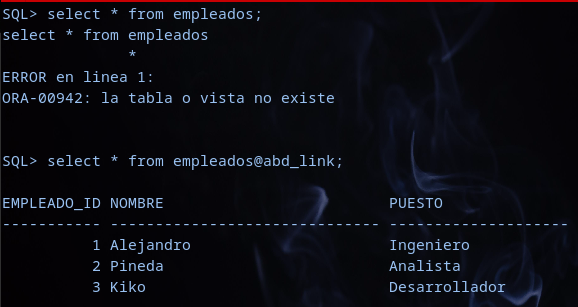


## Realizar un enlace entre dos servidores de bases de datos Postgres, explicando la configuración necesaria en ambos extremos y demostrando su funcionamiento realizando alguna operación que implique el uso simultáneo de ambas bases de datos.
      
Para empezar vamos a crear una base de datos en cada servidor. En el servidor abd: 

```
ale@abd:~$ sudo -u postgres psql
[...]

postgres=# CREATE DATABASE pruebas;
CREATE DATABASE

postgres=# \c pruebas
You are now connected to database "pruebas" as user "postgres".
pruebas=# GRANT ALL PRIVILEGES ON DATABASE pruebas TO alejandro;
GRANT
pruebas=# ALTER DATABASE pruebas OWNER TO alejandro;
ALTER DATABASE
pruebas=> CREATE TABLE empleados(
    empleado_id NUMERIC PRIMARY KEY,
    nombre VARCHAR(20),
    puesto VARCHAR(20));
CREATE TABLE
pruebas=> INSERT INTO empleados VALUES (1,'Alejandro', 'Ingeniero'),(2,'Pineda','Analista'),(3,'Kiko','Desarrollador');
INSERT 0 3

pruebas=> select * from empleados;
 empleado_id |  nombre   |    puesto
-----------------------------------------
           1 | Alejandro | Ingeniero
           2 | Pineda    | Analista
           3 | Kiko      | Desarrollador
(3 filas)
```
Ahora nos vamos al servidor **abd2**
```
ale@abd2:~$ sudo -U alejandro -h 192.168.1.167 -d pruebas 

[...]
pruebas=> CREATE TABLE proyectos(
    proyecto_id NUMERIC PRIMARY KEY,
    nombre VARCHAR(25),
    empleado_id NUMERIC);
CREATE TABLE

pruebas=> INSERT INTO   proyectos VALUES (1,'Infraestructura', 1),(2,'Implantacion sistema',2),(3,'Desarrollo software',3);
INSERT 0 3

pruebas=> select * from proyectos;
 proyecto_id |        nombre        | empleado_id
--------------------------------------------------
           1 | Infraestructura      |           1
           2 | Implantacion sistema |           2
           3 | Desarrollo software  |           3
(3 filas)
```

Ahora  vamos a crear un DBLINK, para ello, habrá que ser superusuario, así que entraremos con el usuario postgres.

Para crear el enlace:
```
postgres=# CREATE EXTENSION dblink;
CREATE EXTENSION
```
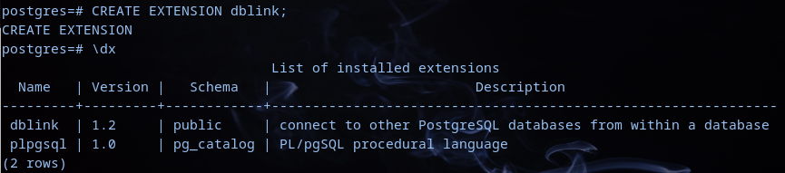

Tanbién lo crearemos en el otro servidor.

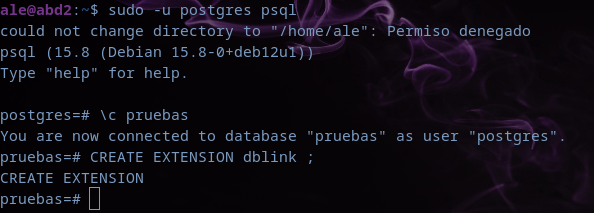

Para comprobar el funcionamiento, nos metemos en el servidor abd y haremos una consulta donde será una consulta a la base de datos del servidor abd2.

```
SELECT * FROM dblink('host=192.168.1.167 dbname=pruebas user=alejandro password=contraseña', 'SELECT proyecto_id, nombre, empleado_id FROM proyectos')
AS proyectos(proyecto_id NUMERIC, nombre VARCHAR, empleado_id NUMERIC);
 proyecto_id |        nombre        | empleado_id
--------------------------------------------------
           1 | Infraestructura      |           1
           2 | Implantacion sistema |           2
           3 | Desarrollo software  |           3
(3 filas)
```

Si hacemos una consulta en la que queramos datos de las dos tablas, como por ejemplo el nombre y el proyecto asociado:

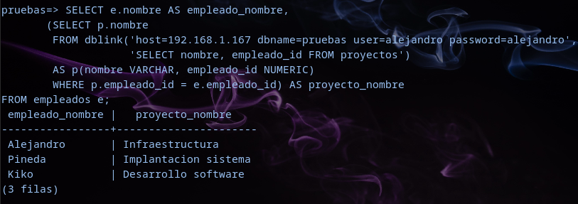


## Realizar un enlace bidireccional entre un servidor ORACLE y otro Postgres empleando Heterogeneus Services, explicando la configuración necesaria en ambos extremos y demostrando su funcionamiento realizando alguna operación que implique el uso simultáneo de ambas bases de datos.

Lo primero que vamos a realizar es la instalación de los controladores para postgresql.

`ale@oracle19:~$ sudo apt install unixodbc odbc-postgresql `

Una vez que ya tengamos los controladores instalados, pasamos a la configuración de algunos archivos necesarios para la interconexión entre Postgresql y Oracle.

El primer fichero a configurar es el **/etc/odbcinst.ini.** Este fichero lo que hace es configurar los controladores ODBC que se van a utilizar para conectarse a diferentes bases de datos. Quedaría de la siguiente manera:
```
ale@oracle19:~$ sudo cat /etc/odbcinst.ini 
[PostgreSQL ANSI]
Description = PostgreSQL ODBC driver (ANSI version)
Driver = /usr/lib/x86_64-linux-gnu/odbc/psqlodbca.so
Debug = 0
CommLog = 1
UsageCount = 1
[PostgreSQL Unicode]
Description = PostgreSQL ODBC driver (Unicode version)
Driver = /usr/lib/x86_64-linux-gnu/odbc/psqlodbcw.so
Debug = 0
CommLog = 1
UsageCount = 1
```

El siguiente fichero de configuración es el **/etc/odbc.ini**. Este fichero lo que hace es configurar las conexiones DSN para bases de datos específicas a través de ODBC

```
ale@oracle19:~$ sudo cat /etc/odbc.ini 
[PSQLA]
Debug = 0
CommLog = 0
ReadOnly = 1
Driver = PostgreSQL ANSI
Servername = 192.168.1.168
Username = alejandro
Password = contraseña
Port = 5432
Database = pruebas
Trace = 0
TraceFile = /tmp/sql.log

[PSQLU]
Debug = 0
CommLog = 0
ReadOnly = 0
Driver = PostgreSQL Unicode
Servername = 192.168.1.168
Username =  alejandro
Password = contraseña
Port = 5432
Database = pruebas
Trace = 0
TraceFile = /tmp/sql.log

[Default]
Driver = /opt/oracle/product/19c/dbhome_1/lib/libsqora.so.19.1
```
Ahora con el comando  **odbcinst -q -d** , vamos a buscar los controladores que hemos configurado anteriormente.

```
ale@oracle19:~$ odbcinst -q -d
[PostgreSQL ANSI]
[PostgreSQL Unicode]
```

También podemos probar el funcionamiento de la conexión a la base de datos Postgres desde el otro servidor. Esto lo haremos con el comando:

`ale@oracle19:~$ isql -v PSQLA`

Si entramos podremos hacer alguna consulta sobre la base de datos de postgres:

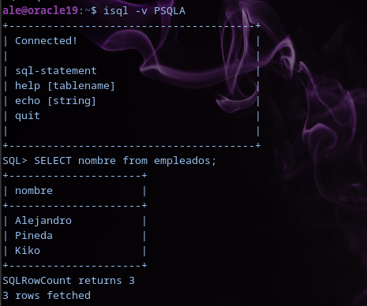

De la misma manera podremos hacerlo con PSQLU

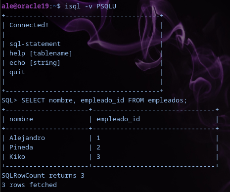

Ahora tendremos que crear un enlace desde Oracle a Postgres. Para ello crearemos un nuevo fichero para que Oracle pueda conectarse a una base de datos externa.

```
ale@oracle19:~$ sudo cat /opt/oracle/product/19c/dbhome_1/hs/admin/initPSQLU.ora 
HS_FDS_CONNECT_INFO = PSQLU
HS_FDS_TRACE_LEVEL = Debug
HS_FDS_SHAREABLE_NAME = /usr/lib/x86_64-linux-gnu/odbc/psqlodbcw.so
HS_LANGUAGE = AMERICAN_AMERICA.WE8ISO8859P1
set ODBCINI=/etc/odbc.ini
```

**HS_FDS_CONNECT_INFO = PSQLU**: Define el nombre del DSN, que anteriormente lo hemos configurado en odbc.ini

**HS_FDS_TRACE_LEVEL = Debug**: Activa el registro de depuración detallada para las conexiones.

**HS_FDS_SHAREABLE_NAME = /usr/lib/x86_64-linux-gnu/odbc/psqlodbcw.so**: Es el archivo del controlador ODBC que Oracle debe usar para conectarse a PostgreSQL.

**HS_LANGUAGE = AMERICAN_AMERICA.WE8ISO8859P1**: Esto configura la configuración regional y la codificación de caracteres para la conexión.

**set ODBCINI=/etc/odbc.ini**: Por último se establece la ubicación del archivo de configuración ODBC que contiene la definición del DSN para PostgreSQL.

A continuación tenemos que modificar el fichero **listener**.ora para incluir la configuración necesaria para que Oracle pueda comunicarse a través del DG4ODBC.

```
ale@oracle19:~$ sudo cat /opt/oracle/product/19c/dbhome_1/network/admin/listener.ora
LISTENER =
  (DESCRIPTION_LIST =
    (DESCRIPTION =
      (ADDRESS = (PROTOCOL = TCP)(HOST = oracle19)(PORT = 1521))
      (ADDRESS = (PROTOCOL = IPC)(KEY = EXTPROC1521))
    )
  )

SID_LIST_LISTENER =
  (SID_LIST =
    (SID_DESC =
      (SID_NAME = PSQLU)
      (ORACLE_HOME = /opt/oracle/product/19c/dbhome_1)
      (PROGRAM = dg4odbc)
    )
  )
```
Por último, también tenemos que modificar el tnsnames.ora para añadir una entrada que permita a Oracle conectarse a PostgreSQL.

```
ale@oracle19:~$ sudo cat /opt/oracle/product/19c/dbhome_1/network/admin/tnsnames.ora 
ORCLCDB =
  (DESCRIPTION =
    (ADDRESS = (PROTOCOL = TCP)(HOST = oracle19)(PORT = 1521))
    (CONNECT_DATA =
      (SERVER = DEDICATED)
      (SERVICE_NAME = ORCLCDB)
    )
  )

LISTENER_ORCLCDB =
  (ADDRESS = (PROTOCOL = TCP)(HOST = oracle19)(PORT = 1521))

PSQLU =
  (DESCRIPTION=
    (ADDRESS=(PROTOCOL=tcp)(HOST=localhost)(PORT=1521))
    (CONNECT_DATA=(SID=PSQLU))
    (HS=OK)
  )
```

Cuando ya lo tengamos todo, podemos reiniciar el servicio de Oracle, para aplicar las modificaciones realizadas.

`ale@oracle10:~$ sudo /etc/init.d/oracledb_ORCLCDB-19c restart`

Y entramos como sys para crear un enlace a la base de datos de PostgreSQL:

```
ale@oracle19:~$ rlwrap sqlplus / as sysdba

SQL> CREATE PUBLIC DATABASE LINK postgres connect to "alejandro" IDENTIFIED BY "alejandro" USING 'PSQLU';

Enlace con la base de datos creado.
```

Ahora nos conectamos con nuestro usuario:

```
SQL> connect alejandro
Introduzca la contraseña: *************
Introduzca la contraseña:
Conectado.
```
Y podemos hacer una consulta a la base de datos de PostgreSQL usando el link creado.

```
SQL> SELECT "nombre" FROM "empleados"@postgres;
nombre
---------------------------------------
Alejandro
Pineda
Kiko
```
También podríamos hacer un join con una tabla que tenemos creada en oracle, de proyectos, para comprobar el funcionamiento.

```
SQL> SELECT p.nombre AS Proyecto, e."nombre" AS Empleado 
FROM PROYECTOS p, "empleados"@postgres e
WHERE p.empleado_id = e."empleado_id"@postgres;
PROYECTO                        EMPLEADO
---------------------------     --------------------------
Desarrollo de Software          Alejandro
Implementación de sistema       Pineda
Infraestructuras                Kiko
```