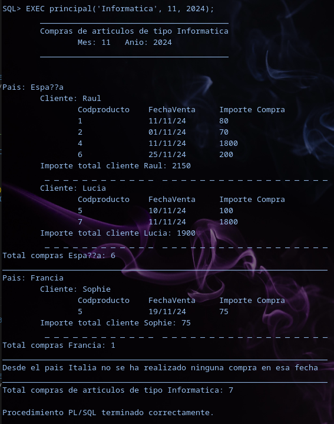
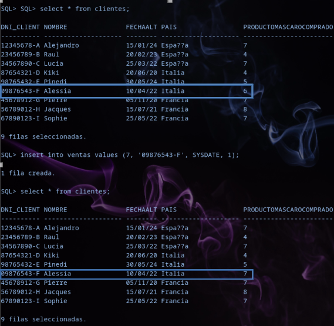
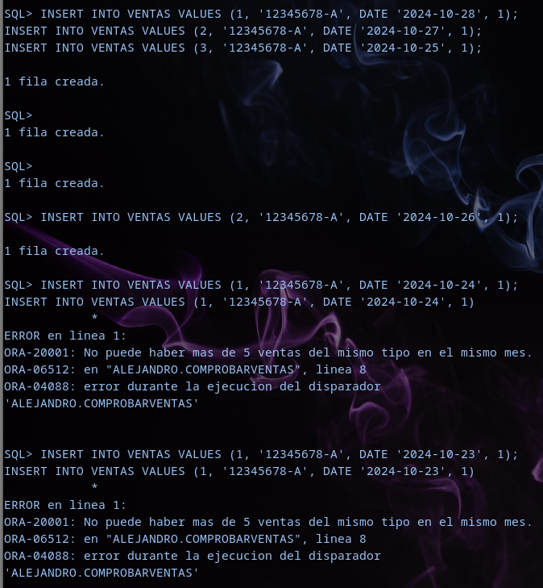
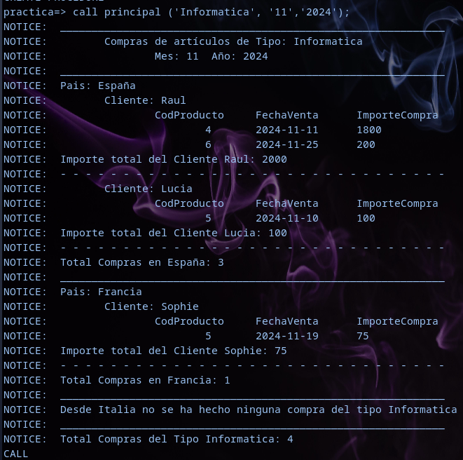
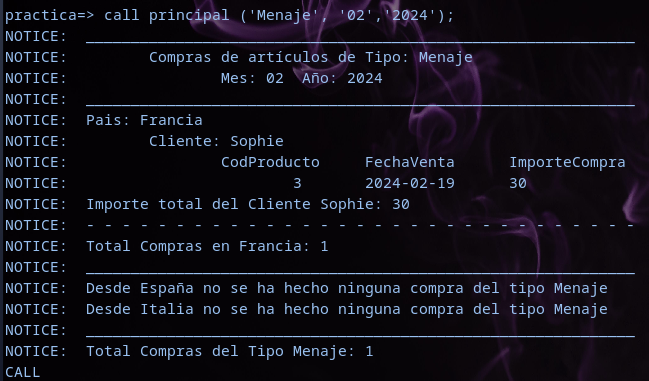
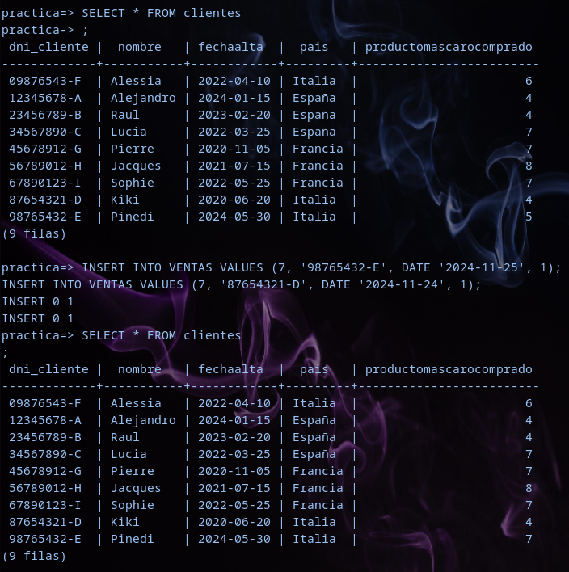

# SQL - PLSQL


##ORACLE
### PARTE SQL


*Crea las siguientes tablas en Postgres y en ORACLE, con las restricciones correspondientes.*


| TABLA PRODUCTOS |  |  |  |
|-----------|-------|---------|-------|
| ***CodProducto***  | NUMBER   |    |
| Nombre  | VARCHAR2, de 20   |    |
| Tipo  | VARCHAR2, de 15   | Menaje, Informática o Telefonía|
| PrecioUnitario  | NUMBER   | Entre 0 y 5000 |

| TABLA CLIENTES |  |  |  |
|-----------|-------|---------|-------|
| ***DNICliente***  | VARCHAR2, de 10   | 8 números, un guión y una mayúscula |
| Nombre  | VARCHAR2, de 20   |    |
| FechaAlta  | Fecha | Posterior a 2019 |
| País | VARCHAR2, de 20   | España, Italia o Francia |

| TABLA VENTAS |  |  |  |
|-------------|-------|---------|-------|
| ***CodProducto***  | NUMBER   |  |
| ***<u>DNICliente</u>***  | VARCHAR2, de 10   |    |
| ***<u>FechaVenta</u>***  | Fecha |  |
| NumUnidades | NUMBER |  |


**TABLA PRODUCTOS**

```
CREATE TABLE PRODUCTOS(
    CodProducto NUMBER,
    Nombre VARCHAR2(20),
    Tipo VARCHAR2 (15),
    PrecioUnitario NUMBER,
    CONSTRAINT PK_productos PRIMARY KEY (CodProducto),
    CONSTRAINT Chk_Tipo CHECK (Tipo IN ('Menaje', 'Informatica', 'Telefonia')),
    CONSTRAINT Chk_Precio CHECK (PrecioUnitario BETWEEN 0 AND 5000) 
);
```
**TABLA CLIENTES**

```
CREATE TABLE CLIENTES(
    DNI_Cliente VARCHAR2(10),
    Nombre VARCHAR2(20),
    FechaAlta DATE,
    Pais VARCHAR2(20),
    CONSTRAINT PK_Clientes PRIMARY KEY (DNI_CLIENTE),
    CONSTRAINT Chk_DNI CHECK (REGEXP_LIKE(DNI_CLIENTE, '^[0-9]{8}-[A-Z]$')),
    CONSTRAINT Chk_Alta CHECK (FechaAlta > DATE '2019-12-31'),
    CONSTRAINT Chk_Pais CHECK (Pais IN ('España', 'Italia', 'Francia'))
);

```
**TABLA VENTAS**

```
CREATE TABLE VENTAS(
    CodProducto NUMBER,
    DNI_Cliente VARCHAR2(10),
    FechaVenta DATE,
    NumUnidades NUMBER,
    CONSTRAINT PK_Ven PRIMARY KEY (DNI_CLIENTE, FechaVenta, CodProducto),
    CONSTRAINT FK_Cod FOREIGN KEY (CodProducto) REFERENCES PRODUCTOS(CodProducto),
    CONSTRAINT FK_Dni FOREIGN KEY (DNI_CLIENTE) REFERENCES CLIENTES(DNI_CLIENTE)   
);
```

**Realizar una consulta que muestre el nombre del último producto que compró cada cliente que ha realizado alguna compra en los últimos diez días.**

```
SELECT P.Nombre as producto, C.Nombre as cliente   
FROM PRODUCTOS P , CLIENTES C 
WHERE (P.codproducto, C.DNI_Cliente) IN (SELECT V.codproducto, V.DNI_Cliente
                                         FROM VENTAS v
                                         WHERE V.FechaVenta IN (SELECT MAX(FechaVenta)
                                                                FROM VENTAS V2 
                                                                WHERE V2.DNI_CLIENTE = V.DNI_CLIENTE)
                                         AND FechaVenta >= SYSDATE -10);

PRODUCTO            CLIENTE
-----------------   ----------
Redmi Note 10       Alejandro
Teclado             Raul
```

**Realizar una consulta que muestre el importe total de las compras de productos de Tipo ‘Menaje’ para cada uno de los clientes junto con el nombre de dicho cliente incluyendo aquellos que no han comprado productos de ese tipo.**

```
SELECT C.Nombre as cliente, COALESCE(SUM(V.NumUnidades * P.PrecioUnitario),0) as importe
FROM Clientes C , PRODUCTOS P, VENTAS V 
WHERE C.DNI_CLIENTE = V.DNI_CLIENTE (+)
AND P.CODPRODUCTO = V.CODPRODUCTO (+)
AND Tipo = 'Menaje'
GROUP BY C.NOmbre;

CLIENTE             IMPORTE
---------------     -----------
Alejandro           60
Raul                150
Lucia               10
Sophie              90
Alessia             0
Kiki                0
Pierre              0
Jacques             0
Pinedi              0

9 filas seleccionadas.
```

**Realizar una vista llamada ‘Productos de Telefonía’ con los siguientes datos: Código del Producto, Nombre del Producto, Importe Total de las Ventas del Producto, Fecha de la última venta del producto y país del primer cliente que lo compró. En la vista solo deben aparecer los artículos de tipo ‘Telefonía’.**

*Primero creo una vista distinta para seleccionar el país del primer cliente que compró cada producto de Telefonía*

```
CREATE OR REPLACE VIEW PrimerPais AS
SELECT Pais, codproducto
FROM CLIENTES C, PRODUCTOS P 
WHERE Tipo = 'Telefonia'
AND (C.DNI_CLIENTE, P.CODPRODUCTO) IN (SELECT V.DNI_CLIENTE, V.CodProducto
                                         FROM VENTAS V 
                                         WHERE FechaVenta = (SELECT MIN(FechaVenta)
                                                             FROM VENTAS V2 
                                                             WHERE V2.CODPRODUCTO = V.CODPRODUCTO));
```
*Vista Principal:*

```
CREATE OR REPLACE VIEW Productos_de_telefonia AS
SELECT P.CODPRODUCTO, P.Nombre,SUM(P.PrecioUnitario * V.NumUnidades) as importe, MAX(FechaVenta) as UltVenta, Pais as Pais_Primera_Compra
FROM VENTAS V, PRODUCTOS P , PrimerPais PP
WHERE V.CODPRODUCTO = P.CODPRODUCTO
AND V.CODPRODUCTO = PP.CODPRODUCTO
AND Tipo = 'Telefonia'
GROUP BY P.codproducto, P.Nombre, Pais;

SELECT * FROM Productos_de_telefonia;

CODPRODUCTO  NOMBRE             IMPORTE  ULTVENTA       PAIS_PRIMERA_COMPRA
-----------  -----------------  -------- -------------  ---------------------
7            Redmi Note 10      4500     28/11/24       España
8            Tablet             750      05/04/23       Francia
9            Smartwatch         300      25/05/22       España
```
**Muestra los distintos tipos de productos junto al nombre del cliente que ha comprado más unidades de ese tipo de producto en los últimos diez años.**
```
SELECT Tipo , C.Nombre as cliente
FROM VENTAS V, PRODUCTOS P, CLIENTES C 
WHERE V.CODPRODUCTO = P.CODPRODUCTO
AND V.DNI_CLIENTE = C.DNI_CLIENTE
GROUP BY Tipo, C.NOmbre
HAVING COUNT(*) = (SELECT MAX(COUNT(*))
                    FROM PRODUCTOS P2, CLIENTES C2
                    WHERE (P2.CodProducto,C2.DNI_Cliente) IN (SELECT V3.CodProducto, V3.DNI_Cliente
                                                            FROM VENTAS V3
                                                            WHERE V3.FechaVenta >= (SYSDATE - (10*365)))
                    AND P2.TIPO = P.TIPO
                    GROUP BY P2.TIPO, C2.NOMBRE);

TIPO           CLIENTE
-----------    ------------
Menaje         Raul
Informatica    Raul
Telefonia      Lucia
Telefonia      Sophie
```

Aparecen 2 de Telefonía porque tienen el mismo n.º de compras.

**Realiza una consulta con operadores de conjuntos que nos diga qué artículos se han vendido tanto en enero como en febrero como en marzo.**

```
SELECT NOMBRE FROM PRODUCTOS
WHERE CODPRODUCTO IN (SELECT CODPRODUCTO FROM VENTAS
                      WHERE TO_CHAR(FechaVenta,'MM')= 01)
INTERSECT
SELECT NOMBRE FROM PRODUCTOS
WHERE CODPRODUCTO IN (SELECT CODPRODUCTO FROM VENTAS
                      WHERE TO_CHAR(FechaVenta,'MM')= 02)
INTERSECT
SELECT NOMBRE FROM PRODUCTOS
WHERE CODPRODUCTO IN (SELECT CODPRODUCTO FROM VENTAS
                      WHERE TO_CHAR(FechaVenta,'MM')= 03);

NOMBRE
--------------
Ordenador
Taza
```

### **PARTE PL/SQL**

**Realizar un procedimiento que reciba un tipo de producto, un mes y un año y muestre un listado de todas las compras que se han realizado de productos de dicho tipo en dicho mes agrupadas por país y cliente.**

*PRINCIPAL*
```
CREATE OR REPLACE PROCEDURE principal (
    p_tipo PRODUCTOS.Tipo%type,
    p_mes NUMBER,
    p_anio NUMBER
) IS
    v_importe_total_tipo NUMBER := 0;
BEGIN
    Excepciones(p_tipo);
    encabezado(p_tipo, p_mes, p_anio);
    paises(p_tipo, p_mes, p_anio, v_importe_total_tipo);
    DBMS_OUTPUT.PUT_LINE('Total Compras de Articulos de Tipo ' || p_tipo || ': ' || v_importe_total_tipo);
    ExcecpcionPais(p_tipo, p_mes, p_anio);
END principal;
/
```

*EXCEPCIONES*
```
CREATE OR REPLACE PROCEDURE Excecpciones(
    p_tipo Productos.Tipo%type
)
IS
    v_num NUMBER;
BEGIN
    v_num:=ExcepcionTipo(p_tipo);
    IF v_num = 0 THEN
        RAISE_APPLICATION_ERROR(-20001, 'No existen articulos de ese tipo');
    ELSE 
        v_num:=ExcepcionVentas(p_tipo);
        IF v_num = 0 THEN
            RAISE_APPLICATION_ERROR(-20002, 'No existen ventas de ese tipo');
        END IF;
    END IF;
END;
/
```

*EXCEPCIÓN DEL TIPO*
```
CREATE OR REPLACE FUNCTION ExcepcionTipo (p_tipo Productos.Tipo%type) return NUMBER
IS
    v_cont NUMBER;
BEGIN
    SELECT COUNT(*) INTO v_cont
    FROM Productos
    WHERE Tipo = p_tipo;
    return v_cont;
END;
/
```

*EXCEPCIÓN VENTAS*
```
CREATE OR REPLACE FUNCTION ExcepcionVentas (p_tipo Productos.Tipo%type) return NUMBER
IS
    v_cont NUMBER;
BEGIN
    SELECT COUNT(*) INTO v_cont
    FROM Ventas
    WHERE CODPRODUCTO IN (SELECT CODPRODUCTO
                          FROM PRODUCTOS
                          WHERE Tipo = p_tipo);
    return v_cont;
END;
/
```

*EXCEPCIÓN PAÍS*
```
CREATE OR REPLACE PROCEDURE ExcPaises(
    p_tipo Productos.Tipo%type,
    p_mes NUMBER, 
    p_anio NUMBER
)
IS
    CURSOR c_paises IS
        SELECT DISTINCT Pais FROM CLIENTES
        MINUS
        SELECT DISTINCT Pais
        FROM CLIENTES
        WHERE DNI_CLIENTE IN (SELECT DNI_CLIENTE
                                  FROM VENTAS 
                                  WHERE TO_CHAR(Fechaventa, 'MM') = p_mes
                                  AND TO_CHAR(FechaVenta, 'YYYY') = p_anio
                                  AND CODPRODUCTO IN (SELECT CODPRODUCTO
                                                      FROM PRODUCTOS 
                                                      WHERE Tipo = p_tipo));
BEGIN
    FOR v_cur IN c_paises LOOP
        DBMS_OUTPUT.PUT_LINE('Desde el pais '|| v_cur.pais|| ' no se ha realizado ninguna compra en esa fecha');
        DBMS_OUTPUT.PUT_LINE('_____________________________________________________________________');

    END LOOP;
END;
/
```

*ENCABEZADO*
```
create or replace procedure encabezado(
    p_tipo Productos.Tipo%type,
    p_mes NUMBER,
    p_anio NUMBER
) IS
BEGIN
    DBMS_OUTPUT.PUT_LINE(CHR(9)||'________________________________________');
    DBMS_OUTPUT.PUT_LINE(CHR(9)|| 'Compras de articulos de tipo '|| p_tipo);
    DBMS_OUTPUT.PUT_LINE(CHR(9)||CHR(9)||'Mes: '||RPAD(p_mes,5)|| 'Anio: '||p_anio);
    DBMS_OUTPUT.PUT_LINE(CHR(9)||'________________________________________');
    DBMS_OUTPUT.PUT_LINE(CHR(11));
END;
/
```

*INFORME*

```
CREATE OR REPLACE PROCEDURE Informe (
    p_tipo Productos.Tipo%type,
    p_mes NUMBER,
    p_anio NUMBER
)
IS
    v_total_compras_articulos NUMBER:=0;
    v_total_compras_pais NUMBER;
    CURSOR c_paises IS
        SELECT DISTINCT pais 
        FROM CLIENTES 
        WHERE DNI_CLIENTE IN (SELECT DNI_CLIENTE 
                              FROM VENTAS 
                              WHERE CODPRODUCTO IN (SELECT CODPRODUCTO
                                                    FROM PRODUCTOS 
                                                    WHERE Tipo = p_tipo)
                              and TO_CHAR(FechaVenta, 'MM') = p_mes
                              and TO_CHAR(FechaVenta, 'YYYY' ) = p_anio);
BEGIN
    FOR v_cur IN c_paises LOOP
        DBMS_OUTPUT.PUT_LINE('Pais: '||v_cur.pais);
        InformePorPais(p_tipo, p_mes, p_anio, v_cur.pais, v_total_compras_pais);
        v_total_compras_articulos := v_total_compras_articulos + v_total_compras_pais;
      DBMS_OUTPUT.PUT_LINE('_____________________________________________________________________');
    END LOOP;
    ExcPaises(p_tipo, p_mes, p_anio);
    DBMS_OUTPUT.PUT_LINE('Total compras de articulos de tipo '|| p_tipo||': '|| v_total_compras_articulos);
END;
/
```

*INFORME POR PAÍS*
```
CREATE OR REPLACE PROCEDURE InformePorPais(
    p_tipo Productos.Tipo%type,
    p_mes NUMBER,
    p_anio NUMBER,
    p_pais Clientes.Pais%type,
    p_compras_pais OUT NUMBER
)
IS
    v_compras_pais NUMBER:=0;
    v_compras_clientes NUMBER;
    CURSOR  c_clientes IS
        SELECT DISTINCT DNI_CLIENTE
        FROM VENTAS 
        WHERE CODPRODUCTO IN (SELECT CODPRODUCTO 
                              FROM PRODUCTOS 
                              WHERE Tipo = p_tipo)
        AND TO_CHAR(FECHAVENTA, 'MM') = p_mes
        AND TO_CHAR (FechaVenta, 'YYYY') = p_anio
        AND DNI_CLIENTE IN (SELECT DNI_CLIENTE 
                            FROM CLIENTES
                            WHERE Pais = p_pais);
    v_nombre CLIENTES.NOmbre%type;
BEGIN
    FOR v_cur IN c_clientes LOOP
        v_nombre:=DevolverNombreCliente(v_cur.DNI_CLIENTE);
        DBMS_OUTPUT.PUT_LINE(CHR(9)|| 'Cliente: '||v_nombre); 
        InformePorCliente(p_tipo, p_mes, p_anio, v_nombre,v_cur.DNI_CLIENTE, v_compras_clientes) ;
        v_compras_pais:=v_compras_pais+v_compras_clientes;
      
    END LOOP;
    DBMS_OUTPUT.PUT_LINE('Total compras '|| p_pais|| ': '|| v_compras_pais);
    p_compras_pais:=v_compras_pais;
END;
/
```

*FUNCIÓN DEVOLVER NOMBRE CLIENTE*
```
CREATE OR REPLACE FUNCTION DevolverNombreCliente (p_dni CLIENTES.DNI_CLIENTE%TYPE)
RETURN CLIENTES.Nombre%type
IS
    v_nombre CLIENTES.Nombre%type;
BEGIN
    SELECT Nombre Into v_nombre
    FROM CLIENTES
    WHERE DNI_CLIENTE = p_dni;
    return v_nombre;
END;
/
```

*INFORME CLIENTES*

```
CREATE OR REPLACE PROCEDURE InformePorCliente(
    p_tipo Productos.Tipo%type,
    p_mes NUMBER,
    p_anio NUMBER, 
    p_nombre CLIENTES.Nombre%type,
    p_dni CLIENTES.DNI_CLIENTe%type,
    p_compras_cliente OUT NUMBER
)
IS
    v_compras_cliente NUMBER:=0;
    v_importe_clientes NUMBER:=0;
    CURSOR c_compras IS
        SELECT p.codproducto as codproducto, Fechaventa, (v.NumUnidades * p.PrecioUnitario) as importe 
        FROM VENTAS V, PRODUCTOS P  
        WHERE V.CODPRODUCTO = P.CODPRODUCTO
        AND DNI_CLIENTE = p_dni
        AND TO_CHAR(Fechaventa, 'MM') = p_mes
        AND TO_CHAR(FechaVenta, 'YYYY') = p_anio;
BEGIN
    DBMS_OUTPUT.PUT_LINE(CHR(9)|| CHR(9) || RPAD('Codproducto', 15)|| RPAD('FechaVenta', 15)||'Importe Compra');
    FOR v_cur IN c_compras LOOP
        DBMS_OUTPUT.PUT_LINE(CHR(9)|| CHR(9) || RPAD(v_Cur.Codproducto, 15)|| RPAD(v_cur.FechaVenta, 15)||v_cur.importe);
        v_compras_cliente:=v_compras_cliente + 1;
        v_importe_clientes:=v_importe_clientes + v_cur.importe;
    END LOOP;
    DBMS_OUTPUT.PUT_LINE(CHR(9)|| 'Importe total cliente '||p_nombre|| ': '|| v_importe_clientes);
    DBMS_OUTPUT.PUT_LINE(CHR(9)||' _ _ _ _ _ _ _ _ _ _ _ _  _ _ _ _ _ _ _ _ _ _ _ _ _ _ _ _ _ _');

    p_compras_cliente:=v_compras_cliente;
END;
/
```

***COMPROBACIÓN***




**Realizar un trigger que cuando se inserte una venta mantenga correctamente actualizada la columna ProductoMasCaroComprado (que previamente has de crear y rellenar mediante un procedimiento) en la tabla Clientes.**

*MODIFICACIÓN TABLA CLIENTES*
```
ALTER TABLE CLIENTES
ADD  ProductoMasCaroComprado NUMBER;
```

*Rellenar columna ProductoMasCaroComprado*

```
CREATE OR REPLACE PROCEDURE RellenarColumna 
IS
    CURSOR c_productos  IS
        SELECT DNI_CLIENTE, CODPRODUCTO
        FROM VENTAS V
        WHERE V.CODPRODUCTO IN (SELECT CODPRODUCTO 
                                FROM PRODUCTOS P 
                                WHERE PrecioUnitario = (SELECT MAX(PRECIOUNITARIO)
                                                         FROM PRODUCTOS P2 
                                                         WHERE P2.CODPRODUCTO IN (SELECT CODPRODUCTO
                                                                                  FROM VENTAS V2
                                                                                  WHERE V2.DNI_CLIENTE = V.DNI_CLIENTE)))
        GROUP BY DNI_CLIENTE, CODPRODUCTO;
BEGIN
    FOR v_cur IN c_productos  LOOP
        UPDATE CLIENTES 
        SET ProductoMasCaroComprado = v_cur.CODPRODUCTO
        WHERE DNI_CLIENTE = v_cur.DNI_CLIENTE;
    END LOOP;
END;
/
```

*Trigger actualizar_producto_mas_caro_clientes*

```
CREATE OR REPLACE TRIGGER ACTUALIZAR_PRODUCTO_MAS_CARO 
AFTER INSERT ON VENTAS
FOR EACH ROW
DECLARE
    v_precio_antiguo PRODUCTOS.PrecioUnitario%type;
    v_precio_nuevo PRODUCTOS.PrecioUnitario%type;
    v_codproducto_mas_caro_actual CLIENTES.ProductoMasCaroComprado%TYPE;
BEGIN
    v_codproducto_mas_caro_actual:=DevolverCodproductoMascaro(:new.DNI_CLIENTE);
    v_precio_antiguo:=DevolverPrecio(v_codproducto_mas_caro_actual);
    v_precio_antiguo:=DevolverPrecio(:new.codproducto);
    IF v_precio_nuevo > v_precio_antiguo THEN
        UPDATE CLIENTES
        SET ProductoMasCaroComprado = :new.codproducto
        WHERE DNI_CLIENTE = :new.DNI_CLIENTE;
    END IF;
END;
/
```

*Funciones DevolverCodproductoMascaro y DevolverPrecio utilizadas en el trigger anterior*

```
CREATE OR REPLACE FUNCTION DevolverCodproductoMascaro (p_dni CLIENTES.DNI_CLIENTE%TYPE)
RETURN CLIENTES.ProductoMasCaroComprado%TYPE
IS
    v_codproducto CLIENTES.ProductoMasCaroComprado%TYPE;
BEGIN
    SELECT ProductoMasCaroComprado INTO v_codproducto
    FROM CLIENTES
    WHERE DNI_CLIENTE = p_dni;
    return v_codproducto;
END;
/
```

```
CREATE OR REPLACE FUNCTION DevolverPrecio(p_codprodcuto PRODUCTOS.CODPRODUCTO%TYPE)
RETURN PRODUCTOS.PrecioUnitario%type
IS
    v_precio NUMBER;
BEGIN
    SELECT PrecioUnitario INTO v_precio 
    FROM PRODUCTOS 
    WHERE CODPRODUCTO = p_codprodcuto;
    return v_precio;
END;
/
```

*COMPROBACIÓN*



**Realiza los módulos de programación necesarios para asegurar que no se venden más de cinco productos de un mismo tipo en un mismo mes natural.**

*Paquete para almacenar una tabla en memoria*

```
CREATE OR REPLACE PACKAGE Nomasde5 AS
    TYPE tRegistroVentas IS RECORD (
        Tipo PRODUCTOS.Tipo%TYPE,
        Num NUMBER               
    );

    TYPE tTablaVentas IS TABLE OF tRegistroVentas
    INDEX BY BINARY_INTEGER;

    vTablaVentas tTablaVentas;
END Nomasde5;
/
```

*Rellenar la tabla del paquete*
```
CREATE OR REPLACE TRIGGER RellenarTablaVentas
BEFORE INSERT OR UPDATE ON VENTAS
FOR EACH ROW
DECLARE
    CURSOR c_NumVentas IS
        SELECT P.Tipo, COUNT(*) AS NumVentas
        FROM PRODUCTOS P, VENTAS V
        WHERE P.CODPRODUCTO = V.CODPRODUCTO
        AND TO_CHAR(V.FechaVenta, 'MM') = TO_CHAR(:new.FechaVenta, 'MM')
        AND TO_CHAR(V.FechaVenta, 'YYYY') = TO_CHAR(:new.FechaVenta, 'YYYY')
        GROUP BY P.Tipo;

    Indice NUMBER := 1;
BEGIN
    Nomasde5.vTablaVentas.DELETE;

    FOR v_Cur IN c_NumVentas LOOP
        Nomasde5.vTablaVentas(Indice).Tipo := v_Cur.Tipo;
        Nomasde5.vTablaVentas(Indice).Num := v_Cur.NumVentas;
        Indice := Indice + 1;
    END LOOP;
END;
/
```

*Trigger que comprueba la tabla*
```
CREATE OR REPLACE TRIGGER ComprobarVentas
BEFORE INSERT OR UPDATE ON VENTAS
FOR EACH ROW
DECLARE
    v_TipoProducto PRODUCTOS.Tipo%TYPE; 
    v_NumVentas NUMBER; 
BEGIN
    v_TipoProducto := DevolverTipo(:NEW.CodProducto);
    v_NumVentas := ObtenerNumVentas(v_TipoProducto);
    IF v_NumVentas >= 5 THEN
        RAISE_APPLICATION_ERROR(-20001, 'No puede haber mas de 5 ventas del mismo tipo en el mismo mes.');
    END IF;
    ActualizarVentas(v_TipoProducto);
END;
/
```

*Función para devolver el tipo del producto*
```
CREATE OR REPLACE FUNCTION DevolverTipo (p_codproducto PRODUCTOS.CODPRODUCTO%TYPE)
RETURN PRODUCTOS.TIPO%TYPE 
IS
    v_TipoProducto PRODUCTOS.TIPO%TYPE;
BEGIN
    SELECT TIPO INTO v_TipoProducto
    FROM PRODUCTOS
    WHERE CODPRODUCTO = p_codproducto;

    RETURN v_TipoProducto;
END;
/
```

*Función para obtener el n.º de ventas*
```
CREATE OR REPLACE FUNCTION ObtenerNumVentas(v_TipoProducto PRODUCTOS.Tipo%TYPE) 
RETURN NUMBER IS
    v_NumVentas NUMBER := 0;
    v_Encontrado BOOLEAN := FALSE;
BEGIN
    FOR i IN Nomasde5.vTablaVentas.FIRST .. Nomasde5.vTablaVentas.LAST LOOP
        IF Nomasde5.vTablaVentas(i).Tipo = v_TipoProducto THEN
            v_NumVentas := Nomasde5.vTablaVentas(i).Num;
            v_Encontrado := TRUE;
        END IF;
    END LOOP;

    IF NOT v_Encontrado THEN
        Nomasde5.vTablaVentas(Nomasde5.vTablaVentas.COUNT + 1).Tipo := v_TipoProducto;
        Nomasde5.vTablaVentas(Nomasde5.vTablaVentas.COUNT).Num := 0;
    END IF;

    RETURN v_NumVentas;
END;
/
```

*Procedimiento para actualizar los datos del paquete*
```
CREATE OR REPLACE PROCEDURE ActualizarVentas(v_TipoProducto PRODUCTOS.Tipo%TYPE) IS
    i NUMBER := Nomasde5.vTablaVentas.FIRST;
BEGIN
    WHILE i IS NOT NULL AND i <= Nomasde5.vTablaVentas.LAST LOOP
        IF Nomasde5.vTablaVentas(i).Tipo = v_TipoProducto THEN
            Nomasde5.vTablaVentas(i).Num := Nomasde5.vTablaVentas(i).Num + 1;
            RETURN;
        END IF;
        i := Nomasde5.vTablaVentas.NEXT(i);
    END LOOP;
    IF i IS NULL THEN
        Nomasde5.vTablaVentas(Nomasde5.vTablaVentas.COUNT + 1).Tipo := v_TipoProducto;
        Nomasde5.vTablaVentas(Nomasde5.vTablaVentas.COUNT).Num := 1; 
    END IF;
END;
/
```

***COMPROBACIÓN***




## POSTGRES

**Crea las siguientes tablas en Postgres y en ORACLE, con las restricciones correspondientes**

*TABLA PRODUCTOS*

```
CREATE TABLE Productos(
    CodProducto NUMERIC,
    Nombre VARCHAR (20),
    Tipo VARCHAR(15),
    PrecioUnitario NUMERIC,
    CONSTRAINT PK_productos PRIMARY KEY(codproducto),
    CONSTRAINT Chk_Tipo CHECK(Tipo IN ('Menaje', 'Informatica', 'Telefonia')),
    CONSTRAINT Chk_Precio CHECK(PrecioUnitario BETWEEN 0 AND 5000)
);
```

*TABLA CLIENTES*

```
CREATE TABLE Clientes(
    DNI_Cliente VARCHAR(10),
    Nombre VARCHAR(20),
    FechaAlta DATE,
    Pais VARCHAR(20),
    CONSTRAINT PK_clientes PRIMARY KEY (DNI_Cliente),
    CONSTRAINT Chk_FechaAlta CHECK (FechaAlta > TO_DATE ('31-12-2019', 'DD-MM-YYYY')),
    CONSTRAINT Chk_DNI CHECK(DNI_CLIENTE ~ '^[0-9]{8}-[A-Z]$'),
    CONSTRAINT Chk_Pais CHECK (Pais IN ('España', 'Italia', 'Francia'))    
);
```

*TABLA VENTAS*

```
CREATE TABLE Ventas(
    CodProducto NUMERIC,
    DNI_Cliente VARCHAR(10),
    FechaVenta DATE,
    NumUnidades NUMERIC,
    CONSTRAINT PK_Ventas PRIMARY KEY (CodProducto, DNI_Cliente, FechaVenta),
    CONSTRAINT FK_Cod FOREIGN KEY (CodProducto) REFERENCES Productos(CodProducto),
    CONSTRAINT FK_Dni FOREIGN KEY (DNI_Cliente) REFERENCES Clientes(DNI_Cliente)
);
```

### SQL
**Realizar una consulta que muestre el nombre del último producto que compró cada cliente que ha realizado alguna compra en los últimos diez días.**

```
SELECT P.Nombre, C.Nombre
FROM Productos P, Clientes C
WHERE (P.CodProducto, C.DNI_Cliente) IN (SELECT V.codproducto, V.DNI_Cliente
                                         FROM VENTAS V
                                         WHERE FechaVenta = (SELECT MAX(V2.FechaVenta)
                                                             FROM VENTAS V2
                                                             WHERE V2.DNI_CLIENTE =V.DNI_CLIENTE
                                                             AND V2.FechaVenta >= CURRENT_DATE - INTERVAL '10 days'));

nombre   | nombre
---------+-------
Teclado  | Raul
Raton    | Sophie
(2 filas)
```

**Realizar una consulta que muestre el importe total de las compras de productos de Tipo ‘Menaje’ para cada uno de los clientes junto con el nombre de dicho cliente incluyendo aquellos que no han comprado productos de ese tipo**

```
SELECT C.Nombre, COALESCE(SUM(P.PrecioUnitario * V.NumUnidades), 0) AS IMP_TOTAL
FROM CLIENTES C
LEFT JOIN VENTAS V ON C.DNI_CLIENTE = V.DNI_CLIENTE
LEFT JOIN PRODUCTOS P ON P.CodProducto = V.CodProducto
AND P.Tipo = 'Menaje'
GROUP BY C.Nombre;

nombre    | imp_total
----------+----------
Kiki      | 0
Raul      | 150
Lucia     | 10
Alejandro | 60
Alessia   | 0
Pierre    | 0
Sophie    | 90
Jacques   | 0
Pinedi    | 0
(9 filas)
```

**Realizar una vista llamada ‘Productos de Telefonía’ con los siguientes datos: Código del Producto, Nombre del Producto, Importe Total de las Ventas del Producto, Fecha de la última venta del producto y país del primer cliente que lo compró. En la vista solo deben aparecer los artículos de tipo ‘Telefonía’**

*PRIMERA VISTA*
```
CREATE OR REPLACE VIEW PrimerPais AS 
SELECT Pais, V.CODPRODUCTO
FROM Clientes C, VENTAS V 
WHERE C.DNI_CLIENTE = V.DNI_CLIENTE
AND V.CODPRODUCTO IN (SELECT CODPRODUCTO
                      FROM PRODUCTOS p
                      WHERE Tipo = 'Telefonia') 
AND FechaVenta = (SELECT MIN(FechaVenta)
                  FROM VENTAS V2
                  WHERE V2.CODPRODUCTO = V.CODPRODUCTO);
```

*VISTA PRINCIPAL*

```
CREATE OR REPLACE VIEW Productos_de_telefonia AS
SELECT P.CodProducto, P.Nombre, SUM(P.PrecioUnitario * V.NumUnidades) as IMP_TOTAL, MAX(V.FechaVenta) AS Ultima_Venta, PP.Pais AS PrimerPaisProducto
FROM PRODUCTOS P, VENTAS V, PrimerPais PP 
WHERE P.CODPRODUCTO = V.CODPRODUCTO
AND PP.CODPRODUCTO = V.CODPRODUCTO
AND P.Tipo = 'Telefonia'
GROUP BY P.CODPRODUCTO, P.NOMBRE, PP.Pais;
```

```
practica=> SELECT * FROM productos_de_telefonia;
 codproducto  |    nombre     | imp_total | ultima_venta | primerpaisproducto
--------------+---------------+-----------+--------------+-----------------
            7 | Redmi Note 10 |      3600 | 2024-11-11   | Francia
            8 | Tablet        |       750 | 2023-04-05   | Francia
            9 | Smartwatch    |       300 | 2022-08-25   | España
```

**Muestra los distintos tipos de productos junto al nombre del cliente que ha comprado más unidades de ese tipo de producto en los últimos diez años.**

```
CREATE OR REPLACE VIEW VentasPorClienteYTipo AS
SELECT P.Tipo, V.DNI_Cliente, COUNT(*) AS cuenta_ventas
FROM PRODUCTOS P, VENTAS V
WHERE P.CodProducto = V.CodProducto
  AND V.FechaVenta >= CURRENT_DATE - INTERVAL '10 year'
GROUP BY P.Tipo, V.DNI_Cliente;
```

```
CREATE OR REPLACE VIEW MaxVentasPorTipo AS
SELECT Tipo, MAX(cuenta_ventas) AS max_ventas
FROM VentasPorClienteYTipo
GROUP BY Tipo;
```

```
SELECT P.Tipo, C.Nombre
FROM PRODUCTOS P, VENTAS V, CLIENTES C, MaxVentasPorTipo M
WHERE P.CodProducto = V.CodProducto
  AND V.DNI_Cliente = C.DNI_Cliente
  AND P.Tipo = M.Tipo
  AND V.FechaVenta >= CURRENT_DATE - INTERVAL '10 year'
GROUP BY P.Tipo, C.Nombre, M.max_ventas
HAVING COUNT(*) = M.max_ventas
ORDER BY P.Tipo;

    tipo     |  nombre
-------------+----------
 Informatica | Alejandro
 Menaje      | Sophie
 Telefonia   | Lucia
 Telefonia   | Sophie
(4 filas)    
```
**Realiza una consulta con operadores de conjuntos que nos diga qué artículos se han vendido tanto en enero como en febrero como en marzo.**

```
SELECT P.Nombre 
FROM PRODUCTOS P 
WHERE CODPRODUCTO IN (SELECT CODPRODUCTO
                      FROM VENTAS
                      WHERE TO_CHAR(FechaVenta, 'MM') = '01')
INTERSECT
SELECT P.Nombre 
FROM PRODUCTOS P 
WHERE CODPRODUCTO IN (SELECT CODPRODUCTO
                      FROM VENTAS
                      WHERE TO_CHAR(FechaVenta, 'MM') = '02')
INTERSECT
SELECT P.Nombre 
FROM PRODUCTOS P 
WHERE CODPRODUCTO IN (SELECT CODPRODUCTO
                      FROM VENTAS
                      WHERE TO_CHAR(FechaVenta, 'MM') = '03')

 nombre 
----------
 Ordenador
 Taza
```

### PL/SQL

**Realizar un procedimiento que reciba un tipo de producto, un mes y un año y muestre un listado de todas las compras que se han realizado de productos de dicho tipo en dicho mes agrupadas por país y cliente. Si no existe ningún artículo de ese tipo debe generarse una excepción, así como si no existen ventas de artículos de ese tipo. Si desde un país no se ha hecho ninguna compra debe aparecer un mensaje indicándolo.**

*PROCEDIMIENTO PRINCIPAL*
```
    CREATE OR REPLACE PROCEDURE principal (
        p_tipo VARCHAR,
        p_mes VARCHAR,
        p_anio VARCHAR
    ) LANGUAGE plpgsql AS $$ 
    BEGIN
        CALL excepciones(p_tipo, p_mes, p_anio);
        CALL encabezado(p_tipo, p_mes, p_anio);
        CALL informe(p_tipo, p_mes, p_anio);
    END;
    $$;
```


*EXCEPCIÓN PRINCIPAL*

```
    CREATE OR REPLACE PROCEDURE excepciones (
        p_tipo VARCHAR,
        p_mes VARCHAR,
        p_anio VARCHAR
    ) LANGUAGE plpgsql
    AS $$
    DECLARE
        v_cont NUMERIC;
    BEGIN
        v_cont := excecpcion_tipo(p_tipo);
        IF v_cont = 0 THEN
            RAISE EXCEPTION 'No existe ningún articulo del tipo %', p_tipo;
        ELSE
            v_cont := excepcion_ventas(p_tipo, p_mes, p_anio);
            IF v_cont = 0 THEN
                RAISE EXCEPTION 'No existen ventas del tipo % en la fecha indicada', p_tipo;
            END IF;
        END IF;
    END;
    $$;
```

*Excepción no existen articulos del tipo introducido*
```
    CREATE OR REPLACE FUNCTION excecpcion_tipo (p_tipo VARCHAR)
    RETURNS NUMERIC LANGUAGE plpgsql 
    AS $$ 
    DECLARE
        v_cont NUMERIC;
    BEGIN
        SELECT COUNT(*) INTO v_cont
        FROM PRODUCTOS
        WHERE Tipo = p_tipo;
        return v_cont;  
    END;
    $$;
```

*Excepción sin ventas del tipo*
```
    CREATE OR REPLACE FUNCTION excepcion_ventas (
        p_tipo VARCHAR,
        p_mes VARCHAR,
        p_anio VARCHAR
        )
    RETURNS NUMERIC LANGUAGE plpgsql
    AS $$
    DECLARE
        v_cont NUMERIC;
    BEGIN
        SELECT COUNT (*) INTO v_cont
        FROM VENTAS
        WHERE CODPRODUCTO IN (SELECT CODPRODUCTO
                            FROM PRODUCTOS 
                            WHERE Tipo = p_tipo)
        AND TO_CHAR(FechaVenta, 'MM') = p_mes
        AND TO_CHAR(FechaVenta, 'YYYY')=  p_anio;
        return v_cont;
    END;
    $$;
```

*Excecpción Pais*
```
    CREATE OR REPLACE PROCEDURE ExcepcionPais (
        p_tipo VARCHAR,
        p_mes VARCHAR,
        p_anio VARCHAR
        )
    LANGUAGE plpgsql AS $$
    DECLARE
        c_paises CURSOR FOR
            SELECT DISTINCT Pais FROM CLIENTES 
            WHERE Pais NOT IN (SELECT Pais FROM CLientes C
                                WHERE C.DNI_CLIENTE IN (SELECT DNI_CLIENTE
                                                        FROM VENTAS
                                                        WHERE CODPRODUCTO IN (SELECT CODPRODUCTO
                                                                            FROM Productos
                                                                            WHERE Tipo = p_tipo)
                                                        AND TO_CHAR(FECHAVENTA, 'MM') = p_mes
                                                        AND TO_CHAR(FechaVenta, 'YYYY')= p_anio));
    BEGIN
        FOR v_cur IN c_paises LOOP
            RAISE NOTICE 'Desde % no se ha hecho ninguna compra del tipo %', v_cur.Pais, p_tipo;
        END LOOP;
    END;
    $$;
```

*COMPROBACIÓN EXCEPCIONES*


*Encabezado*
```
    CREATE OR REPLACE PROCEDURE encabezado(
        p_tipo VARCHAR, 
        p_mes VARCHAR, 
        p_anio VARCHAR
    )
    LANGUAGE plpgsql
    AS $$
    BEGIN
        RAISE NOTICE '_____________________________________________________________';
        RAISE NOTICE E'\tCompras de artículos de Tipo: %', p_tipo;
        RAISE NOTICE E'\t\tMes: %  Año: %', p_mes, p_anio;
        RAISE NOTICE '_____________________________________________________________';

    END;
    $$;
```

*Informe*
```
    CREATE OR REPLACE PROCEDURE Informe(
        p_tipo VARCHAR,
        p_mes VARCHAR,
        p_anio VARCHAR
    ) LANGUAGE plpgsql
    AS $$
    DECLARE
        c_paises CURSOR FOR
            SELECT DISTINCT Pais 
            FROM CLIENTES
            WHERE DNI_CLIENTE IN (SELECT DNI_CLIENTE
                                FROM VENTAS
                                WHERE TO_CHAR(FechaVenta, 'MM') = p_mes
                                AND TO_CHAR(FechaVenta, 'YYYY') = p_anio
                                AND CODPRODUCTO IN (SELECT CODPRODUCTO
                                                    FROM PRODUCTOS
                                                    WHERE Tipo = p_tipo));
        v_total_compras_global NUMERIC := 0;
        v_compras_pais NUMERIC := 0;
    BEGIN
        FOR v_cur IN c_paises LOOP
            RAISE NOTICE 'Pais: %', v_Cur.Pais;
            CALL Informe_Por_Pais(v_cur.Pais, p_tipo, p_mes, p_anio, v_compras_pais);
            v_total_compras_global := v_total_compras_global + v_compras_pais;
        END LOOP;
        CALL ExcepcionPais(p_tipo, p_mes, p_anio);
        RAISE NOTICE '_____________________________________________________________';
        RAISE NOTICE 'Total Compras del Tipo %: %', p_tipo, v_total_compras_global;
    END;
    $$;
```

*Informe Por País*

```
    CREATE OR REPLACE PROCEDURE Informe_Por_Pais(
        p_pais VARCHAR,
        p_tipo VARCHAR,
        p_mes VARCHAR,
        p_anio VARCHAR,
        OUT p_compras_global NUMERIC
    ) LANGUAGE plpgsql AS $$
    DECLARE
        c_informe CURSOR FOR
            SELECT DNI_CLIENTE
            FROM CLIENTES
            WHERE DNI_CLIENTE IN (SELECT DNI_CLIENTE
                                FROM VENTAS
                                WHERE TO_CHAR(FechaVenta, 'MM') = p_mes
                                AND TO_CHAR(FechaVenta, 'YYYY') = p_anio
                                AND CODPRODUCTO IN (SELECT CODPRODUCTO
                                                    FROM PRODUCTOS
                                                    WHERE Tipo = p_tipo)
            AND Pais = p_pais);
        v_nombre VARCHAR;
        v_compras_cliente NUMERIC := 0;
        v_compras_pais NUMERIC := 0;
    BEGIN
        FOR v_cur IN c_informe LOOP
            v_nombre := Devolver_Nombre_Cliente(v_cur.DNI_CLIENTE);
            RAISE NOTICE E'\tCliente: %', v_nombre;
            CALL Informe_Por_Cliente(v_cur.DNI_CLIENTE, p_tipo, p_mes, p_anio, v_nombre, v_compras_cliente);
            v_compras_pais := v_compras_pais + v_compras_cliente;
        END LOOP;
        
        RAISE NOTICE 'Total Compras en %: %', p_pais, v_compras_pais;
        RAISE NOTICE '_____________________________________________________________';
        p_compras_global := v_compras_pais;
    END;
    $$;
```

*Función Devolver_Nombre_Cliente*

```
    CREATE OR REPLACE FUNCTION Devolver_Nombre_Cliente(p_dni VARCHAR)
    RETURNS VARCHAR LANGUAGE plpgsql AS $$
    DECLARE
        v_nombre VARCHAR;
    BEGIN
        SELECT Nombre INTO v_nombre
        FROM CLIENTES
        WHERE DNI_CLIENTE = p_dni;
        RETURN v_nombre;
    END;
    $$;
```

*Informe_Por_Cliente*

```
    CREATE OR REPLACE PROCEDURE Informe_Por_Cliente(
        p_dni VARCHAR,
        p_tipo VARCHAR,
        p_mes VARCHAR,
        p_anio VARCHAR,
        p_cliente VARCHAR,
        OUT p_compras_cliente NUMERIC
    ) LANGUAGE plpgsql AS $$
    DECLARE
        c_clientes CURSOR FOR
            SELECT P.CODPRODUCTO AS codproducto, FechaVenta, (V.NumUnidades * P.PrecioUnitario) AS importecompra
            FROM VENTAS V, PRODUCTOS P 
            WHERE P.CODPRODUCTO = V.CODPRODUCTO
            AND TO_CHAR(FechaVenta, 'MM') = p_mes
            AND TO_CHAR(FechaVenta, 'YYYY') = p_anio
            AND Tipo = p_tipo
            AND DNI_CLIENTE = p_dni;
        v_importe_total_cliente NUMERIC := 0;
        v_compras_cliente NUMERIC := 0;
    BEGIN
        RAISE NOTICE E'\t\tCodProducto \tFechaVenta \tImporteCompra';
        FOR v_cur IN c_clientes LOOP
            RAISE NOTICE E'\t\t\t% \t% \t%', v_cur.codproducto, v_cur.FechaVenta, v_cur.importecompra;
            v_importe_total_cliente := v_importe_total_cliente + v_cur.importecompra;
            v_compras_cliente := v_compras_cliente + 1;
        END LOOP;
        RAISE NOTICE E'Importe total del Cliente %: %', p_cliente, v_importe_total_cliente;
        RAISE NOTICE '- - - - - - - - - - - - - - - - - - - - - - - - - - - - - - -';
        p_compras_cliente := v_compras_cliente; 
    END;
    $$;
```

***Comprobación***







**Realizar un trigger que cuando se inserte una venta mantenga correctamente actualizada la columna ProductoMasCaroComprado (que previamente has de crear y rellenar mediante un procedimiento) en la tabla Clientes.**

*Añadir columna en Clientes*

```
ALTER TABLE CLIENTES
ADD COLUMN ProductoMasCaroComprado NUMERIC;
```

*Rellenar Columna Producto Más Caro*

```
    CREATE OR REPLACE PROCEDURE Rellenar_Columna_Producto_clientes()
    LANGUAGE plpgsql AS $$ 
    DECLARE
        c_productos CURSOR FOR
            SELECT C.DNI_CLIENTE as cliente, V.CODPRODUCTO as codigo 
            FROM CLIENTES C, VENTAS V, PRODUCTOS P  
            WHERE C.DNI_CLIENTE = V.DNI_CLIENTE
            AND V.CODPRODUCTO = P.CODPRODUCTO
            AND P.PRECIOUNITARIO IN (SELECT MAX(PRECIOUNITARIO) 
                                    FROM PRODUCTOS P2, VENTAS V2 
                                    WHERE V2.CODPRODUCTO = P2.CODPRODUCTO
                                    AND V2.DNI_CLIENTE = V.DNI_CLIENTE  
                                    )
            GROUP BY cliente, codigo;
    BEGIN
        for v_cur IN c_productos LOOP 
            UPDATE CLIENTES 
            SET ProductoMasCaroComprado = v_cur.codigo
            WHERE DNI_CLIENTE = v_cur.cliente;
        END LOOP;
    END;
    $$;
```

*Trigger*

```
    CREATE TRIGGER Actualizar_producto_mas_caro_clientes
    AFTER INSERT OR UPDATE ON VENTAS
    FOR EACH ROW
    EXECUTE FUNCTION Actualizar_producto_mas_caro_clientes();
```

*Funciones*

```
    CREATE OR REPLACE FUNCTION Actualizar_producto_mas_caro_clientes()
    RETURNS TRIGGER LANGUAGE plpgsql AS $$ 
    DECLARE 
        v_precio_antiguo NUMERIC;
        v_precio_nuevo  NUMERIC;   
        v_codproducto_mascaro_actual NUMERIC;
    BEGIN
        v_codproducto_mascaro_actual:=Devolver_CodProducto(NEW.DNI_CLIENTE);
        v_precio_antiguo := DevolverPrecioProducto(v_codproducto_mascaro_actual);
        v_precio_nuevo := DevolverPrecioProducto(NEW.CodProducto);
        IF v_precio_nuevo > v_precio_antiguo THEN
            UPDATE CLIENTES
            SET ProductoMasCaroComprado = NEW.CodProducto
            WHERE DNI_CLIENTE = NEW.DNI_CLIENTE;
            RETURN NULL;
        END IF;
        RETURN NULL;
    END;
    $$;
```

*Función DevolverCodProducto*

```
    CREATE OR REPLACE FUNCTION Devolver_CodProducto (p_dni VARCHAR)
    RETURNS NUMERIC LANGUAGE plpgsql AS $$
    DECLARE
        v_codproducto NUMERIC;
    BEGIN
        SELECT ProductoMasCaroComprado INTO v_codproducto
        FROM CLIENTES 
        WHERE DNI_CLIENTE = p_dni;
        return v_codproducto;
    END;
    $$;
```

*Función DevolverPrecioProducto*

```
    CREATE OR REPLACE FUNCTION DevolverPrecioProducto (p_codproducto NUMERIC)
    RETURNS NUMERIC LANGUAGE plpgsql AS $$
    DECLARE
        v_precio NUMERIC;
    BEGIN
        SELECT PrecioUnitario INTO v_precio
        FROM PRODUCTOS 
        WHERE CODPRODUCTO = p_codproducto;
        RETURN v_precio;
    END;
    $$;
```

***Comprobación Trigger***

Para la comprobación inserto dos datos, una debe de actualizar la columna de Pinedi y otra es del cliente Kiki, que el producto introducido nuevo tiene el mismo valor que el que ya tiene como más caro, por lo que no debe actualizar.

